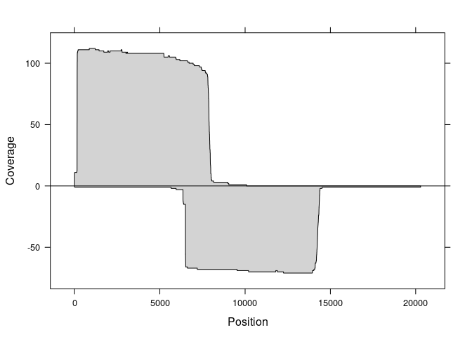

CRISPR cas9 coverage
================
Marcus Davy
12/13/2019

## Metadata

MYB10 coordinates;

``` r
myb10_coords <- import(Sys.getenv("BEDFILE"), format="bed")
print(myb10_coords)
```

    ## GRanges object with 1 range and 2 metadata columns:
    ##       seqnames            ranges strand |        name     score
    ##          <Rle>         <IRanges>  <Rle> | <character> <numeric>
    ##   [1]    Chr09 35542701-35551878      + |   IRHS-2017         0
    ##   -------
    ##   seqinfo: 1 sequence from an unspecified genome; no seqlengths

Checking crRNA alignments to Golden delicious genome;

``` r
# crRNA genome coordinates;
patterns <- krispr_rna_oligos()
ref      <- readDNAStringSet(Sys.getenv("REFERENCE"))

## Sequence matching
mindex1 <- vmatchPattern(patterns[[1]], ref)$Chr09
mindex2 <- vmatchPattern(patterns[[2]], ref)$Chr09
mindex3 <- vmatchPattern(reverseComplement(patterns[[3]]), ref)$Chr09
mindex4 <- vmatchPattern(patterns[[4]], ref)$Chr09

cat(paste("[", names(patterns[1]), "forward matches ])\n"))
```

    ## [ crRNA_RF_1_F forward matches ])

``` r
print(mindex1)
```

    ## IRanges object with 1 range and 0 metadata columns:
    ##           start       end     width
    ##       <integer> <integer> <integer>
    ##   [1]  35542701  35542723        23

``` r
cat(paste("[", names(patterns[2]), "forward matches ])\n"))
```

    ## [ crRNA_RF_2_F forward matches ])

``` r
print(mindex2)
```

    ## IRanges object with 1 range and 0 metadata columns:
    ##           start       end     width
    ##       <integer> <integer> <integer>
    ##   [1]  35542848  35542870        23

``` r
cat(paste("[", names(patterns[3]), " reverse complement matches ])\n"))
```

    ## [ crRNA_RF_3_R  reverse complement matches ])

``` r
print(mindex3)
```

    ## IRanges object with 1 range and 0 metadata columns:
    ##           start       end     width
    ##       <integer> <integer> <integer>
    ##   [1]  35550689  35550711        23

``` r
cat(paste("[", names(patterns[4]), "forward matches ])\n"))
```

    ## [ crRNA_RF_4_F forward matches ])

``` r
print(mindex4)
```

    ## IRanges object with 1 range and 0 metadata columns:
    ##           start       end     width
    ##       <integer> <integer> <integer>
    ##   [1]  35551878  35551900        23

## Checking mapping quality

``` r
## GRanges from baits coordinates
# which <- import(Sys.getenv("BEDFILE"))
chr9_size <- width(readDNAStringSet("/input/genomic/plant/Malus/Genome/GDDH_v1.1/Decompress/GDDH13_1-1_formatted.fasta")["Chr09"])

sinfo <- Seqinfo("Chr09", chr9_size, FALSE, "Golden Delicious")
which <- GRanges(seqnames = "Chr09", IRanges(start=35542701, end=35551878), seqinfo=sinfo)

param <- ScanBamParam(what=scanBamWhat(), which=which,
                      flag=scanBamFlag(isUnmappedQuery=FALSE))
x <- scanBam(Sys.getenv("GUPPY_BAM"), param=param)

##  names(x[[1]])
cat("[ Guppy mapping quality ]")
```

    ## [ Guppy mapping quality ]

``` r
table(x[[1]]["mapq"])
```

    ## 
    ##  24  60 
    ##   1 190

``` r
param <- ScanBamParam(what=scanBamWhat(), which=which,
                      flag=scanBamFlag(isUnmappedQuery=FALSE))
x <- scanBam(Sys.getenv("ALBACORE_BAM"), param=param)

##  names(x[[1]])
cat("[ Albacore mapping quality ]")
```

    ## [ Albacore mapping quality ]

``` r
table(x[[1]]["mapq"])
```

    ## 
    ##  60 
    ## 180

## Validating experimental coverage

We know that the [ont\_tutorial\_cas9 coverage
plots](https://github.com/nanoporetech/ont_tutorial_cas9/issues/6)
contain an error in them. We can check what the underlying data coverage
is from the bam and bed files.

The bed coordinates are;

    09 35542701 35551878 

which relates to the coordinate system `Chr9:35542701-35551878`.

## Bam files

There are two bam files;

``` bash
ls -l $ALBACORE_BAM
ls -l $GUPPY_BAM
```

    ## -rw-rw-r--. 1 hrpelg powerplant 151965339 May  8  2019 /workspace/hrpelg/Red_Flesh_ON/03.minimap2/Redflesh.bam
    ## -rw-rw-r--. 1 hrpelg powerplant 166029506 Oct  7  2019 /workspace/hrpelg/Red_Flesh_ON/Guppy_basecalling/03.minimap2/Guppy_RedFlesh.bam

## Checking the depth in samtools

``` bash
echo "[ GUPPY DEPTH ]"
samtools depth -r Chr09:35542701-35551878 $GUPPY_BAM | head
echo "[ GUPPY REGION SIZE ]"
samtools depth -r Chr09:35542701-35551878 $GUPPY_BAM | wc -l
echo "[ GUPPY # ALIGNMENTS ]"
samtools view -c $GUPPY_BAM Chr09:35542701-35551878

echo "[ ALBACORE DEPTH ]"
samtools depth -r Chr09:35542701-35551878 $ALBACORE_BAM | head
echo "[ GUPPY REGION SIZE ]"
samtools depth -r Chr09:35542701-35551878 $ALBACORE_BAM | wc -l
echo "[ ALBACORE # ALIGNMENTS ]"
samtools view -c $ALBACORE_BAM Chr09:35542701-35551878
```

    ## [ GUPPY DEPTH ]
    ## Chr09    35542701    3
    ## Chr09    35542702    3
    ## Chr09    35542703    3
    ## Chr09    35542704    3
    ## Chr09    35542705    3
    ## Chr09    35542706    3
    ## Chr09    35542707    3
    ## Chr09    35542708    3
    ## Chr09    35542709    3
    ## Chr09    35542710    3
    ## [ GUPPY REGION SIZE ]
    ## 9178
    ## [ GUPPY # ALIGNMENTS ]
    ## 191
    ## [ ALBACORE DEPTH ]
    ## Chr09    35542701    3
    ## Chr09    35542702    3
    ## Chr09    35542703    3
    ## Chr09    35542704    3
    ## Chr09    35542705    3
    ## Chr09    35542706    3
    ## Chr09    35542707    3
    ## Chr09    35542708    3
    ## Chr09    35542709    3
    ## Chr09    35542710    3
    ## [ GUPPY REGION SIZE ]
    ## 9178
    ## [ ALBACORE # ALIGNMENTS ]
    ## 180

## Extracting coverage

Using Rsamtools to extract coverage information from the bam files,
note: no flag filtering is currently used to remove poor quality reads.

``` r
bamfile1 <- Sys.getenv("GUPPY_BAM")
bamfile2 <- Sys.getenv("ALBACORE_BAM")

system.time(guppy_all    <- bamCoverage(1, myb10_coords, bamfile1))
```

    ##    user  system elapsed 
    ##   0.138   0.001   0.140

``` r
system.time(albacore_all <- bamCoverage(1, myb10_coords, bamfile2))
```

    ##    user  system elapsed 
    ##   0.068   0.000   0.068

``` r
system.time(guppy_fwd    <- bamCoverage(1, myb10_coords, bamfile1, orient="fwd"))
```

    ##    user  system elapsed 
    ##   0.068   0.000   0.068

``` r
system.time(albacore_fwd <- bamCoverage(1, myb10_coords, bamfile2, orient="fwd"))
```

    ##    user  system elapsed 
    ##   0.067   0.000   0.196

``` r
system.time(guppy_rev    <- bamCoverage(1, myb10_coords, bamfile1, orient="revcomp"))
```

    ##    user  system elapsed 
    ##   0.069   0.000   0.070

``` r
system.time(albacore_rev <- bamCoverage(1, myb10_coords, bamfile2, orient="revcomp"))
```

    ##    user  system elapsed 
    ##   0.067   0.000   0.067

## Generating coverage dataset

``` r
dat1 <- data.frame(
  pos       = seq(length(guppy_all$cov)) + guppy_all$start - 1,
  coverage  = as.integer(guppy_all$cov),
  type      = "Guppy",
  orient    = "all"
)

dat2 <- data.frame(
  pos       = seq(length(albacore_all$cov)) + albacore_all$start - 1,
  coverage  = as.integer(albacore_all$cov),
  type      = "Albercore",
  orient    = "all"
)

dat3 <- data.frame(
  pos       = seq(length(guppy_fwd$cov)) + guppy_fwd$start - 1,
  coverage  = as.integer(guppy_fwd$cov),
  type      = "Guppy",
  orient    = "forward"
)

dat4 <- data.frame(
  pos       = seq(length(albacore_fwd$cov)) + albacore_fwd$start - 1,
  coverage  = as.integer(albacore_fwd$cov),
  type      = "Albercore",
  orient    = "forward"
)

dat5 <- data.frame(
  pos       = seq(length(guppy_rev$cov)) + guppy_rev$start - 1,
  coverage  = as.integer(guppy_rev$cov),
  type      = "Guppy",
  orient    = "reverse complement"
)

dat6 <- data.frame(
  pos       = seq(length(albacore_rev$cov)) + albacore_rev$start - 1,
  coverage  = as.integer(albacore_rev$cov),
  type      = "Albercore",
  orient    = "reverse complement"
)

## Forward difference
cov1 <- guppy_fwd
cov2 <- albacore_fwd

if(length(cov2$cov) == length(cov1$cov)) {
  delta_start <- cov2$start
}

if(length(cov2$cov) < length(cov1$cov)) {
  toPad <- rep(0, abs(length(cov2$cov) - length(cov1$cov)))
  cov2$cov <- append(cov2$cov, toPad)
  delta_start <- cov2$start
}

if(length(cov1$cov) < length(cov2$cov)) {
  toPad <- rep(0, abs(length(cov2$cov) - length(cov1$cov)))
 cov1$cov <- append(cov1$cov, toPad)
 delta_start <- cov1$start
}

delta <-  cov1$cov - cov2$cov

dat7 <- data.frame(
  pos       = seq(length(delta)) + delta_start - 1,
  coverage  = as.integer(delta),
  type      = "Guppy-Albacore",
  orient    = "forward"
)

## Reverse complement difference
cov1 <- guppy_rev
cov2 <- albacore_rev

if(length(cov2$cov) == length(cov1$cov)) {
  delta_start <- cov2$start
}


if(length(cov2$cov) < length(cov1$cov)) {
  toPad <- rep(0, abs(length(cov2$cov) - length(cov1$cov)))
  cov2$cov <- append(cov2$cov, toPad)
  delta_start <- cov2$start
}

if(length(cov1$cov) < length(cov2$cov)) {
  toPad <- rep(0, abs(length(cov2$cov) - length(cov1$cov)))
 cov1$cov <- append(cov1$cov, toPad)
 delta_start <- cov1$start
}

delta <-  cov1$cov - cov2$cov
dat8 <- data.frame(
  pos       = seq(length(delta)) + delta_start - 1,
  coverage  = as.integer(delta),
  type      = "Guppy-Albacore",
  orient    = "reverse complement"
)

dat <- rbind(dat3, dat4, dat5, dat6, dat7, dat8)
```

Visualizing coverage

``` r
if(use_corrected_canu) {
  xmin <- min(dat$pos) - 6355
  xmax <- max(dat$pos) + 37
} else {
  xmin <- min(dat$pos) ## 35536363
  xmax <- max(dat$pos) ## 35556652
}

xyplot(coverage ~ pos | type, data=dat, xlab="Physical position on Chr09", ylab="Coverage", aspect=1,
       groups=orient, between=list(x=0.3, y=0.3), main=which_coords(myb10_coords), xlim = c(xmin, xmax),
       key = simpleKey(text = c("Forward", "Reverse"), 
            columns = 2, space = "top", lines=TRUE, points=FALSE),
       scales=list(alternating=FALSE), panel=function(x,y, ...) {
         panel.abline(v = start(myb10_coords), col = "darkgrey", lty = 3)
         panel.abline(v = end(myb10_coords),   col = "darkgrey", lty = 3)

         if(plot_kripr_oligos) {
           panel.abline(v = start(mindex1), col = "red",   lty = 3, cex = 0.9)
           panel.abline(v = start(mindex2), col = "green", lty = 3, cex = 0.9)
           panel.abline(v = start(mindex3), col = "green", lty = 3, cex = 0.9)
           panel.abline(v = start(mindex4), col = "red",   lty = 3, cex = 0.9)
         }

         panel.superpose(x,y, type="l", ...)
       })
```

<!-- -->

``` r
## Sanity check start positions
const <- 30
guppy_fwd$start + min(which(guppy_fwd$cov>const))
```

    ## [1] 35542867

``` r
guppy_rev$start + min(which(guppy_rev$cov>const))
```

    ## [1] 35542867

``` r
albacore_fwd$start + min(which(albacore_fwd$cov>const))
```

    ## [1] 35542882

``` r
albacore_rev$start + min(which(albacore_rev$cov>const))
```

    ## [1] 35542867

``` r
## Sanity check end positions
const <- 20
guppy_fwd$end + max(which(guppy_fwd$cov>const))
```

    ## [1] 35560760

``` r
guppy_rev$end + max(which(guppy_rev$cov>const))
```

    ## [1] 35570980

``` r
albacore_fwd$end + max(which(albacore_fwd$cov>const))
```

    ## [1] 35559845

``` r
albacore_rev$end + max(which(albacore_rev$cov>const))
```

    ## [1] 35570970

## Plotting coverage

Guppy coverage;

``` r
min_const <- 3
tweak     <- 2
plot(seq(guppy_all$start, length=length(guppy_all$cov)), guppy_all$cov, type="l", 
     ylim=c(min(guppy_all$cov)-min_const, max(guppy_all$cov)),
     xlab="Coord", ylab="Coverage", 
     main=paste("Guppy MYB10 region",  which_coords(myb10_coords)))
abline(v = start(myb10_coords), col="blue", lty=3)
abline(v = end(myb10_coords),   col="blue", lty=3)
lwd_width <- 1.5
rect(start(mindex1), min(guppy_fwd$cov)-min_const, end(mindex1), min(guppy_fwd$cov)-min_const-tweak, border="darkgreen", lwd=lwd_width)
rect(start(mindex2), min(guppy_fwd$cov)-min_const, end(mindex2), min(guppy_fwd$cov)-min_const-tweak, border="darkgreen", lwd=lwd_width)
rect(start(mindex3), min(guppy_fwd$cov)-min_const, end(mindex3), min(guppy_fwd$cov)-min_const-tweak, border="red", lwd=lwd_width)
rect(start(mindex4), min(guppy_fwd$cov)-min_const, end(mindex4), min(guppy_fwd$cov)-min_const-tweak, border="red", lwd=lwd_width)
```

<!-- -->

Albacore coverage;

``` r
min_const <- 3
tweak     <- 2
plot(seq(albacore_all$start, length=length(albacore_all$cov)), albacore_all$cov, type="l", 
     ylim=c(min(guppy_all$cov)-min_const, max(albacore_all$cov)), 
     xlab="Coord", ylab="Coverage", 
     main=paste("Albacore MYB10 region",  which_coords(myb10_coords)))
abline(v = start(myb10_coords), col="blue", lty=3)
abline(v = end(myb10_coords),   col="blue", lty=3)
lwd_width <- 1.5
rect(start(mindex1), min(albacore_fwd$cov)-min_const, end(mindex1), min(albacore_fwd$cov)-min_const-tweak, border="darkgreen", lwd=lwd_width)
rect(start(mindex2), min(albacore_fwd$cov)-min_const, end(mindex2), min(albacore_fwd$cov)-min_const-tweak, border="darkgreen", lwd=lwd_width)
rect(start(mindex3), min(albacore_fwd$cov)-min_const, end(mindex3), min(albacore_fwd$cov)-min_const-tweak, border="red", lwd=lwd_width)
rect(start(mindex4), min(albacore_fwd$cov)-min_const, end(mindex4), min(albacore_fwd$cov)-min_const-tweak, border="red", lwd=lwd_width)
```

<!-- -->

Difference in coverage between Guppy and Albacore, the parametrization
is (Guppy - Albacore) because Guppy is a newer base caller;

``` r
min_const <- 3
tweak     <- 2
## Difference
if(length(albacore_all$cov) < length(guppy_all$cov)) {
  toPad <- rep(0, abs(length(albacore_all$cov) - length(guppy_all$cov)))
  albacore_all$cov <- append(albacore_all$cov, toPad)
}

if(length(guppy_all$cov) < length(albacore_all$cov)) {
  toPad <- rep(0, abs(length(albacore_all$cov) - length(guppy_all$cov)))
 guppy_all$cov <- append(guppy_all$cov, toPad)
}

delta <-  guppy_all$cov - albacore_all$cov
plot(seq(albacore_all$start, length=length(albacore_all$cov)), delta, type="l", 
     ylim=c(min(delta)-10, max(delta)),
     xlab="Coord", ylab="Coverage", main=paste("Difference: Guppy - Albacore ",  which_coords(myb10_coords)))
abline(h=0, lty=3, col="red")
abline(v = start(myb10_coords), col="blue", lty=3)
abline(v = end(myb10_coords),   col="blue", lty=3)
lwd_width <- 1.5
rect(start(mindex1), min(delta)-min_const, end(mindex1), min(delta)-min_const-tweak, border="darkgreen", lwd=lwd_width)
rect(start(mindex2), min(delta)-min_const, end(mindex2), min(delta)-min_const-tweak, border="darkgreen", lwd=lwd_width)
rect(start(mindex3), min(delta)-min_const, end(mindex3), min(delta)-min_const-tweak, border="red", lwd=lwd_width)
rect(start(mindex4), min(delta)-min_const, end(mindex4), min(delta)-min_const-tweak, border="red", lwd=lwd_width)
```

<!-- -->

When the trace is above zero, it means guppy coverage is consistently
higher than Albacore coverage, in the above plot by approximately 8X
coverage depth.

Note: There are two spike regions which are of interest, these are
regions where one caller or the other has problems. The first suggests
Guppy does better job base calling, the second suggests albacore is
better at calling the region since it is negative.

Let look at these two spike regions in more detail;

``` r
## First region
ind1 <- which(((albacore_all$cov - guppy_all$cov) < -81)==TRUE)

spike1 <- IRanges(ind1+albacore_all$start, width=1)+39

Sys.setenv(SPIKE1S=min(start(spike1)))
Sys.setenv(SPIKE1E=max(end(spike1)))

## Second region
ind2 <- which(((albacore_all$cov - guppy_all$cov) > 25)==TRUE)

spike2 <- IRanges(ind2+albacore_all$start, width=1)+39

Sys.setenv(SPIKE2S=min(start(spike2)))
Sys.setenv(SPIKE2E=max(end(spike2)))
```

Visualizing first spike using `samtools tview`;

``` bash
echo samtools tview -d T -p Chr09:$SPIKE1S-$SPIKE1E $ALBACORE_BAM $REF
samtools tview -d T -p Chr09:$SPIKE1S-$SPIKE1E $ALBACORE_BAM $REF
```

    ## samtools tview -d T -p Chr09:35542841-35542919 /workspace/hrpelg/Red_Flesh_ON/03.minimap2/Redflesh.bam
    ## 35542841    35542851           35542861           35542871            35542881  
    ## N*NNNNNNNNN*NN*N**NNN*NN**N**N*N**N**NN**NNN*N*N*NNN**N*NNNN**N**N**N*N*N**N***N
    ## G CGCAGATCT GT A  CTC CG  T  C T  G  TY  GGT C G GTC  T CTCC  T  A  T C T  C   G
    ## ***gcagatct*gt*a**ctc*cg**t**c*t**g**tc**ggt*c*a*gtc**t*ctcc**t**a**t***t**c***g
    ## g*cgcagatct*gt*a**ctc*cg**t**c*t**g**tc**gg**c*t*gtcagt*ctcc**t**a**t*c*t**c***g
    ## g*cgcagatct*gt*a**c*c*cg**t**c*c**g**tc**ggt*c*a*gtc**t*ctcc**t**a**t*c*t**c***g
    ## G*CGCAGATCT*GT****CTC*AA**TAGCAT**G******GGTAA*A*TTC**T*CT*C**T**A**T*C*T**C***G
    ## G*CGCAGATCT*GTCA**CTC*CG**T**C*T**G**TC**GGT*C*G*GTC****AT*C**T**A**T*C*T**CGA*G
    ## g*cgcagatct*gt*a**ctc*cg**t**c*t**g**tc**ggt*caa*gtc**t*ctcc**t**a**t*c*t**c***g
    ## g*cgcagatct*gt*a**ctc*cg**t**c*t**g**tc**ggt*c*a*gct**t*ctcc**t**a**t***t**c***g
    ## g*cgcagatct*gt*a**ctc*cg**t**c*t**g**tc**ggt*c*a*g****t*ctcc**t**a**t*c*t**c***g
    ## g*cgttg*tct*gt*a**att*cg**t**c*t**g**tc**ggt*c*a*gtc**t*ctcc**t**a**t*c*t**c***g
    ## g*cgcagatct*gt*a**ctc*cg**t**c*t**gtttc***gt*c*a*gtc**t*ctcc**t**a**t*t*t**c***g
    ## g*cgcagatct*gt*a**ctc*cg**t**c*t**g**tt**ggt*c*a*gtc**t*ctcc**t**a**t*c*t**c***g
    ## G*CGCAGATTT*GT*A**CTC*CG**T**C*T**G**TC**GGT*C*A*GTC**T*CT*C**T**A**T*C*T**C***G
    ## A*CG*GGATAT*TC*AC*CTC*CG**TCAC*C**A**TCCGGGT***A*GTC**T*CTCC**T**A****C*T**C***A
    ## G*CGCAGATCT*GT*A**CTCAAG**T**C*T**G**TC**GGT*C*G*GTC**T*CTCC**T**A**T*C*T**C****
    ## g*cgcagatct*gt*a**ct**cg**t**c*t**g**tc**ggt*c*a*g****t*ctcc**t**a**t*c*t**c***g
    ## g*cgcaga*ct*gt*aatctt*cg**c**c*c**g**tc**ggt*c*a*g****t*ctcc**t**a**t*c*t**c***g
    ## G*CGCAGATCT*GT*A**CTC*C***A**C*T**G**TC**GGT*C*G*GTC**T*CTCC**T**A**T*C*T**C****
    ## G*CGCAGATCT*GT*A**CTC*CGTCT**C*T**G**TC**GGT*C*G*GTC**T*CT*C**T**A**T*C*T**C***G
    ## g*cg**tatctcgt*a**ccc*ag**t**t*c**g**tc**ggt*c*gagtt**c*ctcc**t**a**t*c*t**t***a
    ## G*CGCAGATCT*G******TG*CG**T**C*T**G**TC**GGT*C*G*GTC**T*CTCC**T**A**T*C*T**C***G
    ## GAAGCAGATCT*GTGC**CTC*CG**T**C*T**G**TC**GGTCC*A*GTC**T*CTCC**T**A**T*C*T**C****
    ## **agcagatct*gt*a**ctc*cg**t**c*t**g**tc**ggt*c*a*g****t*ctcc**t**a**t*c*t**c***g
    ## g*cgcagatct*ta*a**att*cg**t**c*tacg**tc**ggt*c*a*gt***t*ctcct*t**a**t*c*t**c***g
    ##                                t**g**tt**ggt*c*a*gt***t*ctcc**t**a**t*c*t******g
    ##                                t**g**tt**ggt*c*g*g****t*ctcc**t**a**t*c*t**c***g
    ##                                t**g**tt**ggt*c*a*gtc**t*ctcc**t**a**t*c*t**ct**g
    ##                                          GGT*C*G*GTC**T*CTCC**T**A**T*C*T**C***G
    ##                                          GGT*C*G*GTC**T*CTCC**T**A**TAC*TCCC***G
    ##                                          GGT*C*G*GTC**T*CT*C**T**A**T*C*T**CCA*G
    ##                                          GGT*C*A*GTC**TCCTCC**T**A**T*C*T**C***G
    ##                                          GGT*C*A*GTC**T*CTCC**T**A**T*C*T**C***G
    ##                                          ggt*c*a*gtc**t****c**t**a**t*c*t**c***g
    ##                                          ggt*c*g*gtct*t*ctcc**t**a**t*c*t**c***g
    ##                                          ggt*c*g*gtc**t*ctcc**t**a**tcc*t**t***g
    ##                                          ggt*c*g*gtc**t*ctcc**t**a**t*c*t**c***g
    ##                                          ggt*c*g*gtc**t*ctccctt**a**t*ctt**c***g
    ##                                          ggt*c***gtc**t*ctcc**t**a**t***t**c***g
    ##                                          ggt*c*g*gtc**t**tcc**t**a**t*c*t**c***g
    ##                                          ggt*c*g*gtc**t*ctcc**t**a**t*c*t**c***g
    ##                                           GT*C*A*GTC**T*CTCC**T**A**T*C*T**C***G
    ##                                           GT*C*A*GTC**T*CTCC**T**A**T*C*T**C***G
    ##                                           GT*C*A*GTC**T*CTCC**T**A**T*C*T**C***A
    ##                                           gt*c*g*gt***t*ctcc**t**a**t*c*t**c***g
    ##                                           gt*c*g*g****t*ctcc*****a**t***t**c***g
    ##                                           gt*c*a*gtc**t*ctcc**t**a**t*c*t**c***g
    ##                                           gt*c*g*gtc**t**tcc**c**a**t*c*t**c***g
    ##                                           gt*c*a*gtc**t*ctcc**t**a**t*c*t**ctcgg
    ##                                           gt*c*g*gtt**c*ctcc**t**a**t*c*t**c***g
    ##                                           gt*c*g*gtc**t*ctcc**tgca**t***t**c***g
    ##                                           gt*c*a*gtc**t*ctcc**t**a**t*c*t**c***g
    ##                                           gt*c*g*gtc**t*ctcc**t**a**t*c*t**c***g
    ##                                           gt*c*g*gt***t*ctcc**t**a**t*c*t**c***g
    ##                                           gt*c*g*gtc**t*ctcc**t**a**t*c*t**c***g
    ##                                           gt*c*g*gtc**t*ct*c**t**a**t*c*t**c***g
    ##                                           gt*c*g*gtc**t*ctcc**t**a**t*c*t******g
    ##                                           gt*c*a*gtc**t*ctcc**t**a**t*c*t**c***g
    ##                                           gt*c*g*gtc**t*ct*c**t**atct*c*t**c***g
    ##                                           gt*c*g*gtc**t*ctcc**t**a*************g
    ##                                           gt*c*g*gtc**t*ctcc**t**a**t*c*t**c***g
    ##                                           gt*c*g*gtc**t*ctcc**t**a**t*c*t**c***g
    ##                                           gt*c*g*g****t*ctcc**t**a**t*c*t**ct**g
    ##                                           gt*c*a*gtc**t*ctcc**t**a**t*c*t**c***g
    ##                                           gt*c*g*gtc**t*ctcc**t**a**t*c*t**c***g
    ##                                           gt*c*g*gtc**t*ctcc**t**a**t*c*t**c***g
    ##                                           gt*c*a*gtc**t*ctcc**t**a**t*c*t**c***g
    ##                                           gt*c*g*gtc**t*ctcc**t**a**t*c*t**c***g
    ##                                           gt*c*a*gtc**t*ctcc**t**a**t*c*t**c***g
    ##                                           gt*c*a*gtc**t*ctcc**t**a**t*c*t**c***g
    ##                                           gt*c*g*gtc**t*ctcc*****a**t*t*c**c***g
    ##                                              c*g*gt***t*ctcc**c**a**t***t**c***g
    ##                                                G*GTC**T*CT*C**T**A**T*C*TC*C***G
    ##                                                g*gtc**t*ctcc**t**a**t*c*t**c***g
    ##                                                  GTC**T*CT*C**T**A**T*C*T**C***G
    ##                                                   tc**t*ctcc**t**a**t*c*t**c***g
    ##                                                   tc**t*ctcc**t**a**t*c*t**c***g
    ##                                                   tc**t*ctcc**t**a**t*c*t**c***g
    ##                                                       t*ctcc**t**a**t*c*t**c***g
    ##                                                       t*ctcc**t**at*t*c*t******g
    ##                                                       t*ctcc**t**a**t*c*t**c***g
    ##                                                       t*ctcc**t**a**t*c*t**c***g
    ##                                                         ctcc**t**a**t*c*t**c***g
    ##                                                         ctcc*****a**t*c*t**c***g
    ##                                                           CC**T**A**T*C*T**C****
    ##                                                               T**A**T*C*T**C***G
    ##                                                               T**A**T*C*T**C***G
    ##                                                               T**A**T*C*T**C****
    ##                                                               T**A**T*C*T**C***G
    ##                                                               T**A**T*C*T**C***A
    ##                                                               t**a**t*c*t**c***g
    ##                                                                     T*C*T**C***G
    ##                                                                     T*C*T**C***G
    ##                                                                     T*C*T**C***G
    ##                                                                       C*T**C***G
    ##                                                                       C*T**C***G
    ##                                                                       C*T**C***G
    ##                                                                       C*T**C***G
    ##                                                                       C*T**C***G
    ##                                                                       C*T**C***G
    ##                                                                       C*T**C***G
    ##                                                                       C*T**C***G
    ##                                                                       C*T**C***G
    ##                                                                       C*T**C***G
    ##                                                                       C*T**C***G
    ##                                                                       C*T**C***G
    ##                                                                       C*T**C***G
    ##                                                                       C*T**C***G
    ##                                                                       C*T**C***G
    ##                                                                       C*T**C***G
    ##                                                                       C*T**C***G
    ##                                                                       C*T**C***G
    ##                                                                       C*T**C***G
    ##                                                                       C*T**C***G
    ##                                                                       C*T**C***G
    ##                                                                       C*T**C***G
    ##                                                                       C*T**C***G
    ##                                                                       C*T**C***G
    ##                                                                       C*T**C***G
    ##                                                                       C*T**C***G
    ##                                                                       C*T**C***G
    ##                                                                       C*T**C***G
    ##                                                                       C*T**C***G
    ##                                                                       C*T**C***G
    ##                                                                       C*T**C***G
    ##                                                                       C*T**C***G
    ##                                                                       C*T**C***G
    ##                                                                       C*T**C***G
    ##                                                                       C*T**C***G
    ##                                                                            C***G
    ##                                                                            C***G
    ##                                                                            C***G
    ##                                                                            C***G
    ##                                                                            C***G
    ##                                                                            C***G
    ##                                                                            C***G
    ##                                                                            C***G
    ##                                                                            C***G
    ##                                                                            C***G
    ##                                                                                G
    ##                                                                                G

Visualizing second spike using `samtools tview`;

``` bash
echo samtools tview -d T -p Chr09:$SPIKE2S-$SPIKE1E $ALBACORE_BAM $REF
samtools tview -d T -p Chr09:$SPIKE2S-$SPIKE2E $ALBACORE_BAM $REF
```

    ## samtools tview -d T -p Chr09:35542828-35542919 /workspace/hrpelg/Red_Flesh_ON/03.minimap2/Redflesh.bam
    ##    35542831       35542841    35542851           35542861           35542871    
    ## NNNNNN**NNNNNN***NN*NNNNNNNNN*NN*N**NNN*NN**N**N*N**N**NN**NNN*N*N*NNN**N*NNNN**
    ## AACGGC  AATGCA   GG CGCAGATCT GT A  CTC CG  T  C T  G  TY  GGT C G GTC  T CTCC  
    ## aacggc**aatgca***g***gcagatct*gt*a**ctc*cg**t**c*t**g**tc**ggt*c*a*gtc**t*ctcc**
    ## aacggc**aatgca***gg*cgcagatct*gt*a**ctc*cg**t**c*t**g**tc**gg**c*t*gtcagt*ctcc**
    ## aacggca*aatgca***gg*cgcagatct*gt*a**c*c*cg**t**c*c**g**tc**ggt*c*a*gtc**t*ctcc**
    ## AACGGC**AATGCA***GG*CGCAGATCT*GT****CTC*AA**TAGCAT**G******GGTAA*A*TTC**T*CT*C**
    ## AACGGC***GTACG***AG*CGCAGATCT*GTCA**CTC*CG**T**C*T**G**TC**GGT*C*G*GTC****AT*C**
    ## aacggc**aatgca***gg*cgcagatct*gt*a**ctc*cg**t**c*t**g**tc**ggt*caa*gtc**t*ctcc**
    ## aacggc**aatgcaggtgg*cgcagatct*gt*a**ctc*cg**t**c*t**g**tc**ggt*c*a*gct**t*ctcc**
    ## aacggc**aatgca***gg*cgcagatct*gt*a**ctc*cg**t**c*t**g**tc**ggt*c*a*g****t*ctcc**
    ## aacggc**aatgca***gg*cgttg*tct*gt*a**att*cg**t**c*t**g**tc**ggt*c*a*gtc**t*ctcc**
    ## aacggc**aatgca***gg*cgcagatct*gt*a**ctc*cg**t**c*t**gtttc***gt*c*a*gtc**t*ctcc**
    ## aacggc**aatgca***gg*cgcagatct*gt*a**ctc*cg**t**c*t**g**tt**ggt*c*a*gtc**t*ctcc**
    ## AACGGC**AATGCA***GG*CGCAGATTT*GT*A**CTC*CG**T**C*T**G**TC**GGT*C*A*GTC**T*CT*C**
    ## AACGGC**AATGCA***AA*CG*GGATAT*TC*AC*CTC*CG**TCAC*C**A**TCCGGGT***A*GTC**T*CTCC**
    ## AGCAGC**AATGCA***GG*CGCAGATCT*GT*A**CTCAAG**T**C*T**G**TC**GGT*C*G*GTC**T*CTCC**
    ## aacggcaaaatgca***gg*cgcagatct*gt*a**ct**cg**t**c*t**g**tc**ggt*c*a*g****t*ctcc**
    ## aacggca*aatgca***gg*cgcaga*ct*gt*aatctt*cg**c**c*c**g**tc**ggt*c*a*g****t*ctcc**
    ## AACAGC**AATGCA***GG*CGCAGATCT*GT*A**CTC*C***A**C*T**G**TC**GGT*C*G*GTC**T*CTCC**
    ## AGCAGC**AATGCA***GG*CGCAGATCT*GT*A**CTC*CGTCT**C*T**G**TC**GGT*C*G*GTC**T*CT*C**
    ## aacggc**aatgca***gg*cg**tatctcgt*a**ccc*ag**t**t*c**g**tc**ggt*c*gagtt**c*ctcc**
    ## AGCAGC**AATGCA***GG*CGCAGATCT*G******TG*CG**T**C*T**G**TC**GGT*C*G*GTC**T*CTCC**
    ## AACGGC**AATGCA***GGAAGCAGATCT*GTGC**CTC*CG**T**C*T**G**TC**GGTCC*A*GTC**T*CTCC**
    ## aacggc**aatgca******agcagatct*gt*a**ctc*cg**t**c*t**g**tc**ggt*c*a*g****t*ctcc**
    ## aacggc**aatgca***gg*cgcagatct*ta*a**att*cg**t**c*tacg**tc**ggt*c*a*gt***t*ctcct*
    ##                                                  t**g**tt**ggt*c*a*gt***t*ctcc**
    ##                                                  t**g**tt**ggt*c*g*g****t*ctcc**
    ##                                                  t**g**tt**ggt*c*a*gtc**t*ctcc**
    ##                                                            GGT*C*G*GTC**T*CTCC**
    ##                                                            GGT*C*G*GTC**T*CTCC**
    ##                                                            GGT*C*G*GTC**T*CT*C**
    ##                                                            GGT*C*A*GTC**TCCTCC**
    ##                                                            GGT*C*A*GTC**T*CTCC**
    ##                                                            ggt*c*a*gtc**t****c**
    ##                                                            ggt*c*g*gtct*t*ctcc**
    ##                                                            ggt*c*g*gtc**t*ctcc**
    ##                                                            ggt*c*g*gtc**t*ctcc**
    ##                                                            ggt*c*g*gtc**t*ctccct
    ##                                                            ggt*c***gtc**t*ctcc**
    ##                                                            ggt*c*g*gtc**t**tcc**
    ##                                                            ggt*c*g*gtc**t*ctcc**
    ##                                                             GT*C*A*GTC**T*CTCC**
    ##                                                             GT*C*A*GTC**T*CTCC**
    ##                                                             GT*C*A*GTC**T*CTCC**
    ##                                                             gt*c*g*gt***t*ctcc**
    ##                                                             gt*c*g*g****t*ctcc**
    ##                                                             gt*c*a*gtc**t*ctcc**
    ##                                                             gt*c*g*gtc**t**tcc**
    ##                                                             gt*c*a*gtc**t*ctcc**
    ##                                                             gt*c*g*gtt**c*ctcc**
    ##                                                             gt*c*g*gtc**t*ctcc**
    ##                                                             gt*c*a*gtc**t*ctcc**
    ##                                                             gt*c*g*gtc**t*ctcc**
    ##                                                             gt*c*g*gt***t*ctcc**
    ##                                                             gt*c*g*gtc**t*ctcc**
    ##                                                             gt*c*g*gtc**t*ct*c**
    ##                                                             gt*c*g*gtc**t*ctcc**
    ##                                                             gt*c*a*gtc**t*ctcc**
    ##                                                             gt*c*g*gtc**t*ct*c**
    ##                                                             gt*c*g*gtc**t*ctcc**
    ##                                                             gt*c*g*gtc**t*ctcc**
    ##                                                             gt*c*g*gtc**t*ctcc**
    ##                                                             gt*c*g*g****t*ctcc**
    ##                                                             gt*c*a*gtc**t*ctcc**
    ##                                                             gt*c*g*gtc**t*ctcc**
    ##                                                             gt*c*g*gtc**t*ctcc**
    ##                                                             gt*c*a*gtc**t*ctcc**
    ##                                                             gt*c*g*gtc**t*ctcc**
    ##                                                             gt*c*a*gtc**t*ctcc**
    ##                                                             gt*c*a*gtc**t*ctcc**
    ##                                                             gt*c*g*gtc**t*ctcc**
    ##                                                                c*g*gt***t*ctcc**
    ##                                                                  G*GTC**T*CT*C**
    ##                                                                  g*gtc**t*ctcc**
    ##                                                                    GTC**T*CT*C**
    ##                                                                     tc**t*ctcc**
    ##                                                                     tc**t*ctcc**
    ##                                                                     tc**t*ctcc**
    ##                                                                         t*ctcc**
    ##                                                                         t*ctcc**
    ##                                                                         t*ctcc**
    ##                                                                         t*ctcc**
    ##                                                                           ctcc**
    ##                                                                           ctcc**
    ##                                                                             CC**

## Fwd read coverage only

## Plotting forward read coverage

Guppy coverage;

``` r
min_const <- 3
tweak     <- 2
plot(seq(guppy_fwd$start, length=length(guppy_fwd$cov)), guppy_fwd$cov, type="l", 
     ylim=c(min(guppy_fwd$cov)-min_const, max(guppy_fwd$cov)),
     xlab="Coord", ylab="Forward Coverage", 
     main=paste("Guppy MYB10 region",  which_coords(myb10_coords)))
abline(v = start(myb10_coords), col="blue", lty=3)
abline(v = end(myb10_coords),   col="blue", lty=3)
lwd_width <- 1.5
rect(start(mindex1), min(guppy_fwd$cov)-min_const, end(mindex1), min(guppy_fwd$cov)-min_const-tweak, border="darkgreen", lwd=lwd_width)
rect(start(mindex2), min(guppy_fwd$cov)-min_const, end(mindex2), min(guppy_fwd$cov)-min_const-tweak, border="darkgreen", lwd=lwd_width)
rect(start(mindex3), min(guppy_fwd$cov)-min_const, end(mindex3), min(guppy_fwd$cov)-min_const-tweak, border="red", lwd=lwd_width)
rect(start(mindex4), min(guppy_fwd$cov)-min_const, end(mindex4), min(guppy_fwd$cov)-min_const-tweak, border="red", lwd=lwd_width)
```

<!-- -->

Albacore coverage;

``` r
min_const <- 3
tweak     <- 2
plot(seq(albacore_fwd$start, length=length(albacore_fwd$cov)), albacore_fwd$cov, type="l", 
     ylim=c(min(guppy_fwd$cov)-min_const, max(albacore_fwd$cov)), 
     xlab="Coord", ylab="Forward Coverage", 
     main=paste("Albacore MYB10 region",  which_coords(myb10_coords)))
abline(v = start(myb10_coords), col="blue", lty=3)
abline(v = end(myb10_coords),   col="blue", lty=3)
lwd_width <- 1.5
rect(start(mindex1), min(albacore_fwd$cov)-min_const, end(mindex1), min(albacore_fwd$cov)-min_const-tweak, border="darkgreen", lwd=lwd_width)
rect(start(mindex2), min(albacore_fwd$cov)-min_const, end(mindex2), min(albacore_fwd$cov)-min_const-tweak, border="darkgreen", lwd=lwd_width)
rect(start(mindex3), min(albacore_fwd$cov)-min_const, end(mindex3), min(albacore_fwd$cov)-min_const-tweak, border="red", lwd=lwd_width)
rect(start(mindex4), min(albacore_fwd$cov)-min_const, end(mindex4), min(albacore_fwd$cov)-min_const-tweak, border="red", lwd=lwd_width)
```

<!-- -->

Difference in coverage between Guppy and Albacore ;

``` r
min_const <- 3
tweak     <- 2
## Difference
if(length(albacore_fwd$cov) < length(guppy_fwd$cov)) {
  toPad <- rep(0, abs(length(albacore_fwd$cov) - length(guppy_fwd$cov)))
  albacore_fwd$cov <- append(albacore_fwd$cov, toPad)
}

if(length(guppy_fwd$cov) < length(albacore_fwd$cov)) {
  toPad <- rep(0, abs(length(albacore_fwd$cov) - length(guppy_fwd$cov)))
 guppy_fwd$cov <- append(guppy_fwd$cov, toPad)
}

delta <-  guppy_fwd$cov - albacore_fwd$cov
plot(seq(albacore_fwd$start, length=length(albacore_fwd$cov)), delta, type="l", 
     ylim=c(min(delta)-10, max(delta)),
     xlab="Coord", ylab="Forward Coverage", main=paste("Difference: Guppy - Albacore ",  which_coords(myb10_coords)))
abline(h=0, lty=3, col="red")
abline(v = start(myb10_coords), col="blue", lty=3)
abline(v = end(myb10_coords),   col="blue", lty=3)
lwd_width <- 1.5
rect(start(mindex1), min(delta)-min_const, end(mindex1), min(delta)-min_const-tweak, border="darkgreen", lwd=lwd_width)
rect(start(mindex2), min(delta)-min_const, end(mindex2), min(delta)-min_const-tweak, border="darkgreen", lwd=lwd_width)
rect(start(mindex3), min(delta)-min_const, end(mindex3), min(delta)-min_const-tweak, border="red", lwd=lwd_width)
rect(start(mindex4), min(delta)-min_const, end(mindex4), min(delta)-min_const-tweak, border="red", lwd=lwd_width)
```

<!-- -->

Forward reads are still positively biased between Guppy and Albacore.

## Reverse complement read coverage only

## Plotting reverse complement read coverage

Guppy coverage;

``` r
min_const <- 3
tweak     <- 2
plot(seq(guppy_rev$start, length=length(guppy_rev$cov)), guppy_rev$cov, type="l", 
     ylim=c(min(guppy_rev$cov)-min_const, max(guppy_rev$cov)),
     xlab="Coord", ylab="Reverse Complement Coverage", 
     main=paste("Guppy MYB10 region",  which_coords(myb10_coords)))
abline(v = start(myb10_coords), col="blue", lty=3)
abline(v = end(myb10_coords),   col="blue", lty=3)
lwd_width <- 1.5
rect(start(mindex1), min(guppy_rev$cov)-min_const, end(mindex1), min(guppy_rev$cov)-min_const-tweak, border="darkgreen", lwd=lwd_width)
rect(start(mindex2), min(guppy_rev$cov)-min_const, end(mindex2), min(guppy_rev$cov)-min_const-tweak, border="darkgreen", lwd=lwd_width)
rect(start(mindex3), min(guppy_rev$cov)-min_const, end(mindex3), min(guppy_rev$cov)-min_const-tweak, border="red", lwd=lwd_width)
rect(start(mindex4), min(guppy_rev$cov)-min_const, end(mindex4), min(guppy_rev$cov)-min_const-tweak, border="red", lwd=lwd_width)
```

<!-- -->

Albacore coverage;

``` r
min_const <- 3
tweak     <- 2
plot(seq(albacore_rev$start, length=length(albacore_rev$cov)), albacore_rev$cov, type="l", 
     ylim=c(min(guppy_rev$cov)-min_const, max(albacore_rev$cov)), 
     xlab="Coord", ylab="Reverse Complement Coverage", 
     main=paste("Albacore MYB10 region",  which_coords(myb10_coords)))
abline(v = start(myb10_coords), col="blue", lty=3)
abline(v = end(myb10_coords),   col="blue", lty=3)
lwd_width <- 1.5
rect(start(mindex1), min(albacore_rev$cov)-min_const, end(mindex1), min(albacore_rev$cov)-min_const-tweak, border="darkgreen", lwd=lwd_width)
rect(start(mindex2), min(albacore_rev$cov)-min_const, end(mindex2), min(albacore_rev$cov)-min_const-tweak, border="darkgreen", lwd=lwd_width)
rect(start(mindex3), min(albacore_rev$cov)-min_const, end(mindex3), min(albacore_rev$cov)-min_const-tweak, border="red", lwd=lwd_width)
rect(start(mindex4), min(albacore_rev$cov)-min_const, end(mindex4), min(albacore_rev$cov)-min_const-tweak, border="red", lwd=lwd_width)
```

<!-- -->

Difference in coverage between Guppy and Albacore ;

``` r
min_const <- 3
tweak     <- 2
## Difference
if(length(albacore_rev$cov) < length(guppy_rev$cov)) {
  toPad <- rep(0, abs(length(albacore_rev$cov) - length(guppy_rev$cov)))
  albacore_rev$cov <- append(albacore_rev$cov, toPad)
}

if(length(guppy_rev$cov) < length(albacore_rev$cov)) {
  toPad <- rep(0, abs(length(albacore_rev$cov) - length(guppy_rev$cov)))
 guppy_rev$cov <- append(guppy_rev$cov, toPad)
}

delta <-  guppy_rev$cov - albacore_rev$cov
plot(seq(albacore_rev$start, length=length(albacore_rev$cov)), delta, type="l", 
     ylim=c(min(delta)-10, max(delta)),
     xlab="Coord", ylab="Reverse Complement Coverage", main=paste("Difference: Guppy - Albacore ",  which_coords(myb10_coords)))
abline(h=0, lty=3, col="red")
abline(v = start(myb10_coords), col="blue", lty=3)
abline(v = end(myb10_coords),   col="blue", lty=3)
lwd_width <- 1.5
rect(start(mindex1), min(delta)-min_const, end(mindex1), min(delta)-min_const-tweak, border="darkgreen", lwd=lwd_width)
rect(start(mindex2), min(delta)-min_const, end(mindex2), min(delta)-min_const-tweak, border="darkgreen", lwd=lwd_width)
rect(start(mindex3), min(delta)-min_const, end(mindex3), min(delta)-min_const-tweak, border="red", lwd=lwd_width)
rect(start(mindex4), min(delta)-min_const, end(mindex4), min(delta)-min_const-tweak, border="red", lwd=lwd_width)
```

<!-- -->

Reverse complement difference is unbiased between Guppy and Albacore.

## Scratchpad

``` r
## Sanity check
# These plots are incorrect because they do not adjust for the start of each Rle 
library(chipseq)
```

    ## Loading required package: ShortRead

    ## Loading required package: BiocParallel

    ## Loading required package: GenomicAlignments

    ## Loading required package: SummarizedExperiment

    ## Loading required package: Biobase

    ## Welcome to Bioconductor
    ## 
    ##     Vignettes contain introductory material; view with
    ##     'browseVignettes()'. To cite Bioconductor, see
    ##     'citation("Biobase")', and for packages 'citation("pkgname")'.

    ## Loading required package: DelayedArray

    ## Loading required package: matrixStats

    ## 
    ## Attaching package: 'matrixStats'

    ## The following objects are masked from 'package:Biobase':
    ## 
    ##     anyMissing, rowMedians

    ## 
    ## Attaching package: 'DelayedArray'

    ## The following objects are masked from 'package:matrixStats':
    ## 
    ##     colMaxs, colMins, colRanges, rowMaxs, rowMins, rowRanges

    ## The following object is masked from 'package:Biostrings':
    ## 
    ##     type

    ## The following objects are masked from 'package:base':
    ## 
    ##     aperm, apply, rowsum

``` r
coverageplot(slice(guppy_fwd$cov), slice(guppy_rev$cov))
```

<!-- -->

``` r
coverageplot(slice(albacore_fwd$cov), slice(albacore_rev$cov))
```

<!-- -->

Test Rsamtools;

``` r
bamfile <- guppy_bam 

coord <- "Chr09:35542701-35551878" 
ind <- which(which_coords(myb10_coords)%in%coord)

what  <- scanBamWhat()
param <- ScanBamParam(which=myb10_coords[ind], what=what)
y <- scanBam(bamfile, param=param)

seqname <- names(y)
x <- y[[seqname]]

names(y)
```

    ## [1] "Chr09:35542701-35551878"

``` r
names(x)
```

    ##  [1] "qname"  "flag"   "rname"  "strand" "pos"    "qwidth" "mapq"   "cigar" 
    ##  [9] "mrnm"   "mpos"   "isize"  "seq"    "qual"

Testing coverage;

``` bash
module load htslib/1.9

echo "[ Albacore gzips]"
find /workspace/hrpelg/Red_Flesh_ON/02.poreChop/ -name "*.gz" -exec htsfile {} \;
echo "[ Guppy gzips]"
find /workspace/hrpelg/Red_Flesh_ON/Guppy_basecalling/02.poreChop/ -name "*.gz" -exec htsfile {} \;
```

    ## [ Albacore gzips]
    ## /workspace/hrpelg/Red_Flesh_ON/02.poreChop/All_DS_RedFlesh_ON_run1_cas_after_porechop_dis.fastq.gz:  SAM version 1 gzip-compressed sequence data
    ## [ Guppy gzips]
    ## /workspace/hrpelg/Red_Flesh_ON/Guppy_basecalling/02.poreChop/Merged_RedFlesh_ON_GUPPY_cas.fastq.gz:  SAM version 1 BGZF-compressed sequence data
    ## /workspace/hrpelg/Red_Flesh_ON/Guppy_basecalling/02.poreChop/Alba_guppy.fastqz.gz:   SAM version 1 gzip-compressed sequence data
    ## /workspace/hrpelg/Red_Flesh_ON/Guppy_basecalling/02.poreChop/After_PoreCHOP_RedFlesh_ON_GUPPY_cas.fastq.gz:  SAM version 1 gzip-compressed sequence data
