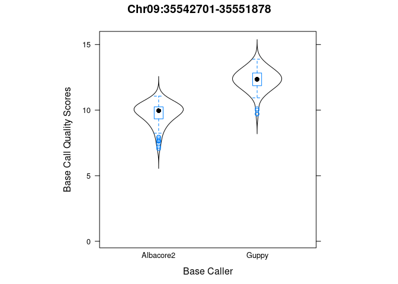

CRISPR cas9 coverage
================
Marcus Davy
12/13/2019

## 0\. Quality control

The [pycoQC](https://github.com/a-slide/pycoQC) was used for quality
control and filtering.

``` bash
#` albacore pycoQC call
bsub -o $WKDIR/01.pycoQC/log/QC1.out -e $WKDIR/01.pycoQC/log/QC1.err -J ONT_QC1 \"pycoQC -f $WKDIR/albacore2/Red_flesh_ON_run1_Cas9/all_summary_run1.txt -o $WKDIR/01.pycoQC/pycoQC_summary_run1

#` Guppy pycoQC call
bsub -o $WKDIR/01.pycoQC/log/QC1.out -e $WKDIR/01.pycoQC/log/QC1.err -J ONT_QC1 \"pycoQC -f $WKDIR/sequencing_summary.txt $WKDIR/01.pycoQC/pycoQC_summary_run1
```

## Sanity check files generation times

``` bash
./check_dates.sh
```

    ## -rw-rw-r--. 1 hrpelg powerplant 1595833 May  7  2019 /workspace/hrpelg/Red_Flesh_ON/albacore2/Red_flesh_ON_run1_Cas9/all_summary_run1.txt
    ## -rw-rw-r--. 1 hrpelg powerplant 103551626 May  7  2019 /workspace/hrpelg/Red_Flesh_ON/02.poreChop/All_DS_RedFlesh_ON_run1_cas_after_porechop_dis.fastq.gz
    ## -rwxr-xr-x. 1 hrpelg powerplant 1763876 Oct  4  2019 /workspace/hrpelg/Red_Flesh_ON/Guppy_basecalling/sequencing_summary.txt
    ## -rwxr-xr-x. 1 hrpelg powerplant 116048737 Oct  7  2019 /workspace/hrpelg/Red_Flesh_ON/Guppy_basecalling/02.poreChop/After_PoreCHOP_RedFlesh_ON_GUPPY_cas.fastq.gz

## 1\. Load bed coordinate Metadata

MYB10 coordinates;

``` r
myb10_coords <- import(Sys.getenv("BEDFILE"), format="bed")
print(myb10_coords)
```

    ## GRanges object with 1 range and 2 metadata columns:
    ##       seqnames            ranges strand |        name     score
    ##          <Rle>         <IRanges>  <Rle> | <character> <numeric>
    ##   [1]    Chr09 35542701-35551878      + |   IRHS-2017         0
    ##   -------
    ##   seqinfo: 1 sequence from an unspecified genome; no seqlengths

## 2\. Load Base call summaries

Summary statistics from `albacore2`, and `guppy` base callers. The
summary files have changed slightly between the two base callers, they
do not have identical column
fields;

``` r
albacore_summary <- read.table("/workspace/hrpelg/Red_Flesh_ON/albacore2/Red_flesh_ON_run1_Cas9/all_summary_run1.txt", header=TRUE, as.is = TRUE)
# albacore_summary <- read.table("/workspace/hramwd/github/analysis-workflows/Malus/Red_Flesh_ON/albacore2/Red_flesh_ON_run1_Cas9/all_summary_run1.txt", header=TRUE, as.is = TRUE)
guppy_summary <- read.table("/workspace/hrpelg/Red_Flesh_ON/Guppy_basecalling/sequencing_summary.txt", header=TRUE, as.is = FALSE)

dim(albacore_summary)
```

    ## [1] 7056   19

``` r
dim(guppy_summary)
```

    ## [1] 7056   18

``` r
table(albacore_summary$passes_filtering)
```

    ## 
    ## False  True 
    ##   974  6082

``` r
table(guppy_summary$passes_filtering)
```

    ## 
    ## FALSE  TRUE 
    ##   678  6378

``` r
#`
#` Create filtered summaries
#`
albacore_summary_pass <- albacore_summary[albacore_summary$passes_filtering%in%"True", ]
albacore_summary_fail <- albacore_summary[albacore_summary$passes_filtering%in%"True", ]
guppy_summary_pass    <- guppy_summary[guppy_summary$passes_filtering%in%TRUE, ]
guppy_summary_fail    <- guppy_summary[guppy_summary$passes_filtering%in%FALSE, ]
```

### Differences in summary fields

There are a few subtle changes in the reported summary statistics
fields;

    ## [ Field names: intersection ]

    ##  [1] "filename"                 "read_id"                 
    ##  [3] "run_id"                   "channel"                 
    ##  [5] "start_time"               "duration"                
    ##  [7] "num_events"               "passes_filtering"        
    ##  [9] "template_start"           "num_events_template"     
    ## [11] "template_duration"        "sequence_length_template"
    ## [13] "mean_qscore_template"     "strand_score_template"

    ## [ Field names: Unique to albacore ]

    ## [1] "num_called_template"                  
    ## [2] "calibration_strand_genome_template"   
    ## [3] "calibration_strand_identity_template" 
    ## [4] "calibration_strand_accuracy_template" 
    ## [5] "calibration_strand_speed_bps_template"

    ## [ Field names: Unique to guppy ]

    ## [1] "batch_id"        "mux"             "median_template" "mad_template"

### Sanity checking two separate albacore runs

Base calling using albacore were independently run against the same
`fast5` files, checking the statistics summary files generated
illustrates that the records returned may be in a different row position
probably due to differences in results return order from
parallelisation;

``` r
basecall_stats_versions()
```

    ## [ hramwd run albacore dimensions ]
    ## [1] 7056   19
    ## [ hrpelg run albacore dimensions ]
    ## [1] 7056   19

<!-- -->

## 3\. Load Fastq files

The Fastq files generated by each base caller should be the same length;

``` r
#` Albacore fastq reads
if(PORECHOP) {
  #` Porechop adapter trimmed fastq files
  albacore.fq <- readFastq("/workspace/hrpelg/Red_Flesh_ON/02.poreChop/All_DS_RedFlesh_ON_run1_cas_after_porechop_dis.fastq.gz")
  guppy.fq    <- readFastq("/workspace/hrpelg/Red_Flesh_ON/Guppy_basecalling/02.poreChop/After_PoreCHOP_RedFlesh_ON_GUPPY_cas.fastq.gz")
} else {
  #` Raw fastq files
  albacore.fq <- readFastq("/workspace/hrpelg/Red_Flesh_ON/albacore2/All_DS_RedFlesh_ON_run1_cas.fastq")
  guppy.fq    <- readFastq("/workspace/hrpelg/Red_Flesh_ON/Guppy_basecalling/02.poreChop/Merged_RedFlesh_ON_GUPPY_cas.fastq.gz")
}

length(albacore.fq)
```

    ## [1] 6106

``` r
length(guppy.fq)
```

    ## [1] 7052

however the `albacore` base caller returns the filtered reads, while the
`guppy` base caller returns 7052 unfiltered reads.

### Sanity check duplicate sequences in fastq files

We appear to have 24 duplicate sequences in the `albacore.fq` file;

    ## [ albacore duplicate table ]

    ## 
    ##    1    2 
    ## 6058   24

    ## [ albacore duplicate ids ]

    ##  [1] "00986955-624b-462e-a76b-2811435e51ba"
    ##  [2] "00cfb4bb-b78c-499d-b44f-4bdfcc09ede5"
    ##  [3] "01531616-9556-4c00-b80d-8aec50c4ab34"
    ##  [4] "00c6ac2c-8ff3-4a0c-80c8-91d2abcd7bda"
    ##  [5] "00cf0df9-b459-4be9-b70f-64cd1df2a977"
    ##  [6] "012f00b6-c3fb-4347-add7-b26f6da478a2"
    ##  [7] "00a27f19-9368-4eb0-b5cd-5c62b18bed36"
    ##  [8] "006c95c5-d9a6-43f7-9961-4ee6f4de65e8"
    ##  [9] "0154cb43-d436-4fc1-a822-104f70afde8f"
    ## [10] "01fd669c-4160-44ab-aa47-220f2f230437"
    ## [11] "0211976e-086b-4083-83c4-ed38843c17b7"
    ## [12] "01d9ab3e-5ffc-4d47-9b01-a5e500605115"
    ## [13] "01455441-afa9-499b-a1b1-38c3de5de68e"
    ## [14] "0088bc8f-f225-4987-a4e0-1ed2d51368b0"
    ## [15] "0017be96-2a39-4547-a255-ed9ba9bc0b2c"
    ## [16] "00d003bd-04ed-4616-9626-646b1b66bc8b"
    ## [17] "00ce4d57-e8dc-473b-9b41-f7820e02f1bc"
    ## [18] "00212653-5459-481c-abac-9fcda80ce46e"
    ## [19] "00cf9db4-03ce-41dd-a9ba-51d3a0c6e029"
    ## [20] "001a41f1-0b7a-4f08-bac8-95d876f69ef6"
    ## [21] "007a9957-614d-4014-a2e7-1750e3c67449"
    ## [22] "001976f0-de53-4ae6-85e8-48829ee3b787"
    ## [23] "0112ba23-9ad3-4d41-832b-ee55811a4a62"
    ## [24] "00297bd2-5e2d-44c5-b75b-e6ff7f499e9d"

    ## [ Sorted albacore sequences ]

    ##   A DNAStringSet instance of length 48
    ##      width seq
    ##  [1]  1002 AAAAACTACAATAAAAGCCTCGAATGTTGGACG...TAAAATATCGGTCATATTCATAGCAATACGTAA
    ##  [2]  1002 AAAAACTACAATAAAAGCCTCGAATGTTGGACG...TAAAATATCGGTCATATTCATAGCAATACGTAA
    ##  [3] 12593 AAATTGTATTTCTTTTTAAAATATGTTTTAGGA...AAAGGCACACTGGCTTCTCCTCTTTGACCGCAG
    ##  [4] 12593 AAATTGTATTTCTTTTTAAAATATGTTTTAGGA...AAAGGCACACTGGCTTCTCCTCTTTGACCGCAG
    ##  [5]  4726 AAGCCGGTAAACAAGCTCTTTGTTGTTGGCTAA...TATGCTTGATTTGAAGGCTGGTGAATACAACGA
    ##  ...   ... ...
    ## [44]  2041 TTCATGTGGACACATAAAACAAATTACTTTAAA...AATCTCCGTCTCCTCTTGTGGGTCCATTGGATC
    ## [45]  1008 TTCTAATAACGTCCTGCGGCAACAATATAGAGC...TCCACGATACGGAAGAGCGTTATAATTCAACGA
    ## [46]  1008 TTCTAATAACGTCCTGCGGCAACAATATAGAGC...TCCACGATACGGAAGAGCGTTATAATTCAACGA
    ## [47] 11386 TTTTGAGAAAATTATACGTTTATGTCTCATTTA...CGAAGAAAATGGGTGAAAACGAAGGAGAATGGC
    ## [48] 11386 TTTTGAGAAAATTATACGTTTATGTCTCATTTA...CGAAGAAAATGGGTGAAAACGAAGGAGAATGGC

    ## [ guppy duplicate table ]

    ## 
    ##    1 
    ## 7052

Fix the albacore.fq data set by removing the duplicates;

``` r
#` Subset unique albacore sequences
albacore_unique.fq <- albacore.fq[!albacore_dups$dup_ind]

length(albacore_unique.fq)
```

    ## [1] 6082

### Sanity check Fastq files to statistics

The `albacore` base caller filters the sequences, so the number of
sequences should match the number of passed sequences in the table.

``` r
expect_equal(
  sort(split_ids(ShortRead::id(albacore_unique.fq))),
  sort(albacore_summary$read_id[albacore_summary$passes_filtering%in%"True"])
)
```

The unfiltered `guppy` fastq file should have the same number of
sequences as records in the statistics summary, however there appears to
be 4 additional records in the summary not present in the `guppy` fastq
file;

    ## [ Unfiltered guppy fastq sequences ]

    ## [1] 7052

    ## [ guppy statistics records ]

    ## [1] 7056

What are the 4 additional guppy records?

``` r
cat("[ missing ids ]\n")
```

    ## [ missing ids ]

``` r
setdiff(guppy_summary$read_id, split_ids(ShortRead::id(guppy.fq)))
```

    ## [1] "56772c11-431c-4081-a4f2-3434868945ac"
    ## [2] "fbfb526a-9101-4ea3-b550-8930954c01a2"
    ## [3] "62152ec8-2fbc-4a62-b6a9-0ba9d03265a3"
    ## [4] "e91965ce-3454-43d3-94c8-bf1100b483f5"

``` r
missing_ind <- which(!guppy_summary$read_id%in%split_ids(ShortRead::id(guppy.fq)))


cat("[ widths of missing sequences: sequence_length_template field ]\n")
```

    ## [ widths of missing sequences: sequence_length_template field ]

``` r
guppy_summary[missing_ind, "sequence_length_template"]
```

    ## [1]     4    39 46991   134

``` r
knitr::kable(guppy_summary[missing_ind,])
```

|      | filename                                                    | read\_id                             | run\_id                                  | batch\_id | channel | mux | start\_time |  duration | num\_events | passes\_filtering | template\_start | num\_events\_template | template\_duration | sequence\_length\_template | mean\_qscore\_template | strand\_score\_template | median\_template | mad\_template |
| ---- | :---------------------------------------------------------- | :----------------------------------- | :--------------------------------------- | --------: | ------: | --: | ----------: | --------: | ----------: | :---------------- | --------------: | --------------------: | -----------------: | -------------------------: | ---------------------: | ----------------------: | ---------------: | ------------: |
| 1257 | FAK77153\_381a627fa445f6ab43dcbb0542d4cc06427d04b3\_1.fast5 | 56772c11-431c-4081-a4f2-3434868945ac | 381a627fa445f6ab43dcbb0542d4cc06427d04b3 |         0 |      77 |   2 |    46477.84 |   3.00600 |        6012 | FALSE             |        46477.84 |                  6012 |            3.00600 |                          4 |               3.619523 |                       0 |         62.81604 |      2.684446 |
| 2637 | FAK77153\_381a627fa445f6ab43dcbb0542d4cc06427d04b3\_1.fast5 | fbfb526a-9101-4ea3-b550-8930954c01a2 | 381a627fa445f6ab43dcbb0542d4cc06427d04b3 |         0 |      77 |   2 |    51581.49 |   4.51125 |        9022 | FALSE             |        51581.49 |                  9022 |            4.51125 |                         39 |               2.550976 |                       0 |         64.06878 |      2.326520 |
| 2860 | FAK77153\_381a627fa445f6ab43dcbb0542d4cc06427d04b3\_1.fast5 | 62152ec8-2fbc-4a62-b6a9-0ba9d03265a3 | 381a627fa445f6ab43dcbb0542d4cc06427d04b3 |         0 |     164 |   3 |    44760.41 | 126.10750 |      252215 | TRUE              |        44760.70 |                251650 |          125.82500 |                      46991 |              11.535305 |                       0 |         96.81902 |     12.169489 |
| 3049 | FAK77153\_381a627fa445f6ab43dcbb0542d4cc06427d04b3\_1.fast5 | e91965ce-3454-43d3-94c8-bf1100b483f5 | 381a627fa445f6ab43dcbb0542d4cc06427d04b3 |         0 |     213 |   3 |    65784.55 |   2.38850 |        4777 | FALSE             |        65784.55 |                  4777 |            2.38850 |                        134 |               5.128243 |                       0 |         42.23528 |      8.053338 |

## 4\. Load bam coverage

Using Rsamtools to extract coverage information from the bam files,
note: no flag filtering is currently used to remove poor quality reads.

``` r
bamfile1 <- Sys.getenv("GUPPY_BAM")
bamfile2 <- Sys.getenv("ALBACORE_BAM")
guppy_all    <- bamCoverage(1, myb10_coords, bamfile1)
albacore_all <- bamCoverage(1, myb10_coords, bamfile2)
guppy_fwd    <- bamCoverage(1, myb10_coords, bamfile1, orient="fwd")
albacore_fwd <- bamCoverage(1, myb10_coords, bamfile2, orient="fwd")
guppy_rev    <- bamCoverage(1, myb10_coords, bamfile1, orient="revcomp")
albacore_rev <- bamCoverage(1, myb10_coords, bamfile2, orient="revcomp")
```

Note: The field `passes_filtering` logical has changed to upper case for
`guppy`, probably for downstream analysis using R.

## 5\. Publication: Table 3

Try to replicate the figures in table 3;

``` r
table3 <- data.frame(
  Method           = c("Albacore2","Guppy"), 
  All_reads        = c(nrow(albacore_summary), nrow(guppy_summary)),
  Pass_reads       = c(nrow(albacore_summary_pass), nrow(guppy_summary_pass)),
  bases_all        = c(sum(albacore_summary$sequence_length_template), sum(guppy_summary$sequence_length_template)),
  bases_pass       = c(sum(albacore_summary_pass$sequence_length_template), sum(guppy_summary_pass$sequence_length_template)),
  median_all       = c(median(albacore_summary$sequence_length_template), median(guppy_summary$sequence_length_template)),
  median_pass      = c(median(albacore_summary_pass$sequence_length_template), median(guppy_summary_pass$sequence_length_template)),
  N50_all          = c(N50(albacore_summary$sequence_length_template), N50(guppy_summary$sequence_length_template)),
  N50_pass         = c(N50(albacore_summary_pass$sequence_length_template), N50(guppy_summary_pass$sequence_length_template)),
  median_qual_all  = c(round(median(albacore_summary$mean_qscore_template), 2), round(median(guppy_summary$mean_qscore_template), 2)),
  median_qual_pass = c(round(median(albacore_summary_pass$mean_qscore_template), 2), round(median(guppy_summary_pass$mean_qscore_template), 2))
)

knitr::kable(table3)
```

| Method    | All\_reads | Pass\_reads | bases\_all | bases\_pass | median\_all | median\_pass | N50\_all | N50\_pass | median\_qual\_all | median\_qual\_pass |
| :-------- | ---------: | ----------: | ---------: | ----------: | ----------: | -----------: | -------: | --------: | ----------------: | -----------------: |
| Albacore2 |       7056 |        6082 |  112578716 |   106589486 |      9783.5 |      11359.0 |    30416 |     30910 |              9.11 |               9.28 |
| Guppy     |       7056 |        6378 |  113972292 |   109526241 |      9891.5 |      11008.5 |    30635 |     30825 |             11.22 |              11.39 |

### Table 3 amended

There is one read ID which is present and a pass in the guppy summary
file, however it is missing from the guppy fastq file.

``` r
setdiff(guppy_summary_pass$read_id, split_ids(ShortRead::id(guppy.fq)))
```

    ## [1] "62152ec8-2fbc-4a62-b6a9-0ba9d03265a3"

This record should be removed for an amended version of Table
3;

``` r
missing_id <- setdiff(guppy_summary_pass$read_id, split_ids(ShortRead::id(guppy.fq)))

guppy_summary_pass    <- guppy_summary[guppy_summary$passes_filtering%in%TRUE  & (!guppy_summary$read_id%in%missing_id), ]
guppy_summary_fail    <- guppy_summary[guppy_summary$passes_filtering%in%FALSE & (!guppy_summary$read_id%in%missing_id), ]

table3_amended <- data.frame(
  Method           = c("Albacore2","Guppy"),
  All_reads        = c(nrow(albacore_summary), nrow(guppy_summary)),
  Pass_reads       = c(nrow(albacore_summary_pass), nrow(guppy_summary_pass)),
  bases_all        = c(sum(albacore_summary$sequence_length_template), sum(guppy_summary$sequence_length_template)),
  bases_pass       = c(sum(albacore_summary_pass$sequence_length_template), sum(guppy_summary_pass$sequence_length_template)),
  median_all       = c(median(albacore_summary$sequence_length_template), median(guppy_summary$sequence_length_template)),
  median_pass      = c(median(albacore_summary_pass$sequence_length_template), median(guppy_summary_pass$sequence_length_template)),
  N50_all          = c(N50(albacore_summary$sequence_length_template), N50(guppy_summary$sequence_length_template)),
  N50_pass         = c(N50(albacore_summary_pass$sequence_length_template), N50(guppy_summary_pass$sequence_length_template)),
  median_qual_all  = c(round(median(albacore_summary$mean_qscore_template), 2), round(median(guppy_summary$mean_qscore_template), 2)),
  median_qual_pass = c(round(median(albacore_summary_pass$mean_qscore_template), 2), round(median(guppy_summary_pass$mean_qscore_template), 2))
)

knitr::kable(table3_amended)
```

| Method    | All\_reads | Pass\_reads | bases\_all | bases\_pass | median\_all | median\_pass | N50\_all | N50\_pass | median\_qual\_all | median\_qual\_pass |
| :-------- | ---------: | ----------: | ---------: | ----------: | ----------: | -----------: | -------: | --------: | ----------------: | -----------------: |
| Albacore2 |       7056 |        6082 |  112578716 |   106589486 |      9783.5 |        11359 |    30416 |     30910 |              9.11 |               9.28 |
| Guppy     |       7056 |        6377 |  113972292 |   109479250 |      9891.5 |        11008 |    30635 |     30825 |             11.22 |              11.39 |

### Sanity check summary statistics

``` r
#`
#` Comparing sequence length to `sequence_length_template` field
#` ind <- 1 fails for albacore...
ind <- 2
expect_equal(width(sread(albacore_unique.fq[grepl( albacore_summary$read_id[ind], id(albacore_unique.fq))])), albacore_summary[ind, "sequence_length_template"])
expect_equal(width(sread(guppy.fq[grepl( guppy_summary$read_id[ind], id(guppy.fq))])), guppy_summary[ind, "sequence_length_template"])


## Quality
albacore_summary[ind, ]
```

    ##                                     filename
    ## 2 00cfb4bb-b78c-499d-b44f-4bdfcc09ede5.fast5
    ##                                read_id                                   run_id
    ## 2 00cfb4bb-b78c-499d-b44f-4bdfcc09ede5 381a627fa445f6ab43dcbb0542d4cc06427d04b3
    ##   channel start_time duration num_events passes_filtering template_start
    ## 2      99   50990.59  4.89375       3915             True              0
    ##   num_events_template template_duration num_called_template
    ## 2                3915           4.89375                3915
    ##   sequence_length_template mean_qscore_template strand_score_template
    ## 2                     2041                8.759                -4e-04
    ##   calibration_strand_genome_template calibration_strand_identity_template
    ## 2                       filtered_out                                   -1
    ##   calibration_strand_accuracy_template calibration_strand_speed_bps_template
    ## 2                                   -1                                     0

``` r
summary(as(quality(albacore_unique.fq[grepl( albacore_summary$read_id[ind], id(albacore_unique.fq))]), "numeric"))
```

    ##    Min. 1st Qu.  Median    Mean 3rd Qu.    Max. 
    ##    1.00    7.00   12.00   12.55   18.00   27.00

``` r
guppy_summary[ind, ]
```

    ##                                                    filename
    ## 2 FAK77153_381a627fa445f6ab43dcbb0542d4cc06427d04b3_1.fast5
    ##                                read_id                                   run_id
    ## 2 11b7b0ee-0a4c-46f9-88ee-58db0cd81f12 381a627fa445f6ab43dcbb0542d4cc06427d04b3
    ##   batch_id channel mux start_time duration num_events passes_filtering
    ## 2        0      56   1   16549.63 53.36375     106727             TRUE
    ##   template_start num_events_template template_duration sequence_length_template
    ## 2       16549.67              106646          53.32325                    11570
    ##   mean_qscore_template strand_score_template median_template mad_template
    ## 2             10.54434                     0        81.07027     11.09571

``` r
summary(as(quality(guppy.fq[grepl( guppy_summary$read_id[ind], id(guppy.fq))]), "numeric"))
```

    ##    Min. 1st Qu.  Median    Mean 3rd Qu.    Max. 
    ##    1.00   11.00   21.00   20.61   29.00   66.00

## 6\. Generate data sets for figures

``` r
#`
#` Sanity check read IDs to subset
#`
setdiff(guppy_summary$read_id, split_ids(ShortRead::id(guppy.fq)))
```

    ## [1] "56772c11-431c-4081-a4f2-3434868945ac"
    ## [2] "fbfb526a-9101-4ea3-b550-8930954c01a2"
    ## [3] "62152ec8-2fbc-4a62-b6a9-0ba9d03265a3"
    ## [4] "e91965ce-3454-43d3-94c8-bf1100b483f5"

``` r
#` The missing long read is not in the Fastq file
setdiff(guppy_summary_pass$read_id, split_ids(ShortRead::id(guppy.fq)))
```

    ## character(0)

``` r
table(guppy_summary_pass$read_id %in% split_ids(ShortRead::id(guppy.fq)))
```

    ## 
    ## TRUE 
    ## 6377

``` r
length(intersect(split_ids(ShortRead::id(guppy.fq)), guppy_summary_pass$read_id))
```

    ## [1] 6377

``` r
#`
#` Filter guppy.fq for passed reads only
#`
guppy_subset_ind <- split_ids(ShortRead::id(guppy.fq))%in%guppy_summary_pass$read_id
guppy_pass.fq <- guppy.fq[guppy_subset_ind]

if(PORECHOP) {
  expect_equal(length(guppy_pass.fq), 6377)
} else {
  expect_equal(length(guppy_pass.fq), 6378)
}

dset <- rbind(
  data.frame(Method="Albacore2", width=width(albacore_unique.fq)),
  data.frame(Method="Guppy", width=width(guppy_pass.fq))
)

#`
#` Summaries in same order as Fastq files
#`
ind <- match(split_ids(ShortRead::id(albacore_unique.fq)), albacore_summary$read_id)
albacore_summary_pass_sort <- albacore_summary[ind,]

ind <- match(split_ids(ShortRead::id(guppy_pass.fq)), guppy_summary$read_id)
guppy_summary_pass_sort <- guppy_summary[ind,]

## Sanity check
expect_equal(as.character(albacore_summary_pass_sort$read_id), split_ids(ShortRead::id(albacore_unique.fq)))
expect_equal(as.character(guppy_summary_pass_sort$read_id), split_ids(ShortRead::id(guppy_pass.fq)))


if(!grepl("aklppr31", Sys.getenv("HOSTNAME"))) {
  tmpl <- system.file(package="batchtools", "templates", "openlava-simple.tmpl")
  bparam <- MulticoreParam(workers=WORKERS) ## , template=tmpl)
  register(bparam)
}


#`
#` Extract quality scores
#`
metric <- mean

if(DEBUG) {
  system.time(guppy_qual <- unlist(bplapply(1:n, filter_quality, quality(guppy_pass.fq), fun=metric, BPPARAM = bpparam("MulticoreParam"))))
  system.time(albacore_qual <- unlist(bplapply(1:n, filter_quality, quality(albacore_unique.fq), fun=metric, BPPARAM = bpparam("MulticoreParam"))))
  #` Sanity check
  #` system.time(median_quality(,  quality(guppy.fq)[1:n]))
} else {
  system.time(guppy_qual <- unlist(bplapply(seq(guppy_pass.fq), filter_quality, quality(guppy_pass.fq), fun=metric, BPPARAM = bpparam("MulticoreParam"))))
  system.time(albacore_qual <- unlist(bplapply(seq(albacore_unique.fq), filter_quality, quality(albacore_unique.fq), fun=metric, BPPARAM = bpparam("MulticoreParam"))))
}
```

    ##    user  system elapsed 
    ##   1.316   0.880   4.032

## Sanity checking widths

We have base calling summaries which have a `sequence_length_template`
field, and filtered Fastq which have sequence widths, we neeed to check
they are equal;

``` r
#` Albacore
albacore_width <- data.frame(read_id   = albacore_summary_pass_sort$read_id, 
                             width_sum = albacore_summary_pass_sort$sequence_length_template, 
                             width_fq = width(albacore_unique.fq)) # porechoped adapters

albacore_width_issues <- albacore_width[albacore_width$width_sum!=albacore_width$width_fq,]
head(albacore_width_issues)
```

    ##                                read_id width_sum width_fq
    ## 1 00986955-624b-462e-a76b-2811435e51ba      2599     2568
    ## 2 00c6ac2c-8ff3-4a0c-80c8-91d2abcd7bda      6075     6022
    ## 4 006c95c5-d9a6-43f7-9961-4ee6f4de65e8     12628    12593
    ## 5 00a27f19-9368-4eb0-b5cd-5c62b18bed36     11418    11386
    ## 6 00cf0df9-b459-4be9-b70f-64cd1df2a977      7521     7462
    ## 7 01531616-9556-4c00-b80d-8aec50c4ab34      1054     1008

``` r
dim(albacore_width_issues)
```

    ## [1] 5343    3

``` r
#` One read longer than 
table(albacore_width$width_sum>=albacore_width$width_fq)
```

    ## 
    ## TRUE 
    ## 6082

``` r
plot(albacore_summary_pass_sort$sequence_length_template, width(albacore_unique.fq), pch=16, cex=0.3, log="xy")
```

<!-- -->

``` r
#` Guppy
guppy_width <- data.frame(read_id   = guppy_summary_pass_sort$read_id, 
                             width_sum = guppy_summary_pass_sort$sequence_length_template, 
                             width_fq = width(guppy_pass.fq)) # porechoped adapters

guppy_width_issues <- guppy_width[guppy_width$width_sum!=guppy_width$width_fq,]
head(guppy_width_issues)
```

    ##                                 read_id width_sum width_fq
    ## 4  6f6da979-2c68-47b2-81e4-0186af5f19f8      4301     4288
    ## 8  d8ecb2ec-3b5e-43cc-918a-e19dbc893632     41917    41910
    ## 9  dee664c2-734c-46c8-8405-83d90182af58       899      873
    ## 11 2fc75e38-0e94-40ba-9da6-c02d92b3e587       172      157
    ## 13 4f0a06a4-4ec9-4365-88fd-df3a724ed916      6687     6673
    ## 14 aede5be0-233e-4560-90f2-bad448827c53     32439    32422

``` r
dim(guppy_width_issues)
```

    ## [1] 1624    3

``` r
table(guppy_width$width_sum>=guppy_width$width_fq)
```

    ## 
    ## TRUE 
    ## 6377

``` r
plot(guppy_summary_pass_sort$sequence_length_template, width(guppy_pass.fq), pch=16, cex=0.3, log="xy")
```

<!-- -->

There are discrepancies.

## Visualizing width vs quality

``` r
albacore_summary_qual <- albacore_summary_pass_sort$mean_qscore_template
guppy_summary_qual    <- guppy_summary_pass_sort$mean_qscore_template


if(DEBUG) {
dcols <- densCols(guppy_qual, width(guppy.fq)[1:n])
plot(guppy_qual, width(guppy.fq)[1:n], pch=16, cex=0.4, col=dcols,
     main = "Guppy", xlab="Quality", ylab="Read Length")

dcols <- densCols(albacore_qual, width(albacore.fq)[1:n])
plot(albacore_qual, width(albacore.fq)[1:n], pch=16, cex=0.4, col=dcols,
     main = "Albacore2", xlab="Quality", ylab="Read Length")
} else {
  dcols <- densCols(guppy_qual, width(guppy.fq))
plot(guppy_qual, width(guppy.fq), pch=16, cex=0.4, col=dcols,
     main = "Guppy", xlab="Quality", ylab="Read Length")

dcols <- densCols(albacore_qual, width(albacore.fq))
plot(albacore_qual, width(albacore.fq), pch=16, cex=0.4, col=dcols,
     main = "Albacore2", xlab="Quality", ylab="Read Length")
}
```

<!-- --><!-- -->

### Visualizing sequence widths

``` r
#`
#` https://github.com/Actinidia/GBS/blob/98b36d3bc5fcb2cdc41b506dc17ffd21261397f0/RandomTagvsStandard/paper/figureGeneration.Rmd
#`
nBins   <- seq(0, log10(max(dset$width)), length=70+1)
xAxis <- 0:7
plotObj1 <- histogram( ~ log10(width) |  Method, data=dset, col="white", breaks=nBins,
          aspect=1, layout=c(2,1), xlab=expression(log[10]("Read Length")),
          type="count",
          scales = list(x = list(alternating=FALSE, at=xAxis, rot=90, labels=(10^xAxis))),
          between=list(x=0.3, y=0.3), panel=function(x,y, ...){
            panel.histogram(x, ...)
            panel.abline(v=N50(x), lty=3, col="red")
            panel.text(x=N50(x), y=470, "N50", cex=0.75)
          })
print(plotObj1)
```

<!-- -->

## Visualizing contig length metric

``` r
f <- seq(0,1, length=201)

dset_Nf <- rbind(
  data.frame(Method="Albacore2", f = f, Nf = sapply(f, function(x)Nf(albacore_summary_pass_sort$sequence_length_template, x))),
  data.frame(Method="Guppy",     f = f, Nf = sapply(f, function(x)Nf(guppy_summary_pass_sort$sequence_length_template, x)))
#` data.frame(Method="Guppy - Albacore", f=f,
#`            Nf = sapply(f, function(x)Nf(width(guppy.fq), x)) - sapply(f, function(x)Nf(width(albacore.fq), x)))
)

#` contig length needed to cover 50% of the genome
xAxis <- seq(0, 120000, length=4)
plotObj3 <- xyplot(f ~ Nf | Method, data=dset_Nf, layout=c(2,1), between=list(x=0.3, y=0.3),
       xlab=expression(paste(N[f],  ", contig length to cover fraction (f) of the genome")),
        scales = list(x = list(alternating=FALSE, at=xAxis, rot=0)),
                       ylab="fraction (f)",
                       panel=function(x,y, ...) {
                         panel.lines(x,y, ...)
                         ind <- which(y==0.5)
                         panel.text(x[ind], y[ind], label=bquote(N[50] == .(x[ind])))
                       })
print(plotObj3)
```

<!-- -->

## Generating Base quality data set

The total number of quality scores based on raw fastq data;

``` r
sum(width(quality(albacore.fq)))
```

    ## [1] 106571236

``` r
sum(width(quality(guppy.fq)))
```

    ## [1] 113899787

These are too many quality scores to visualize in R, and the files are
reflective of all derived reads, not the ones in the region of interest
only.

Extracting Base quality scores in region of interest;

``` r
#` Albacore fastq reads
albacore_region.fq <- readFastq("fastq_region/All_DS_RedFlesh_ON_run1_cas_after_porechop_dis.fastq.gz")
guppy_region.fq    <- readFastq("fastq_region/After_PoreCHOP_RedFlesh_ON_GUPPY_cas.fastq.gz")

# dset<- rbind(
#    data.frame(Method="Albacore2", quality=as(quality(albacore_region.fq), "numeric")),
#    data.frame(Method="Guppy", quality=as(quality(guppy_region.fq), "numeric"))
# )

#`
#` Summaries in same order as Fastq files
#`
ind <- match(split_ids(ShortRead::id(albacore_region.fq)), albacore_summary$read_id)
albacore_summary_region_sort <- albacore_summary[ind,]

ind <- match(split_ids(ShortRead::id(guppy_region.fq)), guppy_summary$read_id)
guppy_summary_region_sort <- guppy_summary[ind,]

## Sanity check
expect_equal(as.character(albacore_summary_region_sort$read_id), split_ids(ShortRead::id(albacore_region.fq)))
expect_equal(as.character(guppy_summary_region_sort$read_id), split_ids(ShortRead::id(guppy_region.fq)))


dset<- rbind(
   data.frame(Method="Albacore2", quality=albacore_summary_region_sort$mean_qscore_template),
   data.frame(Method="Guppy", quality=guppy_summary_region_sort$mean_qscore_template)
)


dim(dset)
```

    ## [1] 312   2

``` r
#` Summary statistics (Text above Table 3)
with(dset, tapply(quality, Method, function(x)round(summary(x),2)))
```

    ## $Albacore2
    ##    Min. 1st Qu.  Median    Mean 3rd Qu.    Max. 
    ##    7.05    9.34    9.95    9.72   10.24   11.07 
    ## 
    ## $Guppy
    ##    Min. 1st Qu.  Median    Mean 3rd Qu.    Max. 
    ##    9.69   11.86   12.36   12.31   12.83   13.88

### Visualizing sequence quality

``` r
#`
#` https://github.com/Actinidia/GBS/blob/98b36d3bc5fcb2cdc41b506dc17ffd21261397f0/RandomTagvsStandard/paper/figureGeneration.Rmd
#`
nBins   <- seq(0, max(dset$quality), length=90+1)
xAxis <- 0:7

#` Histogram
plotObj4 <- histogram( ~ quality |  Method, data=dset, col="white", breaks=nBins,
          aspect=1, layout=c(2,1), xlab=expression("Quality Score"),
          type="count", main=which_coords(myb10_coords),
          scales = list(x = list(alternating=FALSE)), #, at=xAxis, rot=90, labels=(xAxis))),
          between=list(x=0.3, y=0.3), panel=function(x,y, ...){
            panel.histogram(x, ...)
          })
print(plotObj4)
```

<!-- -->

``` r
#` Violin plot - see example(panel.violin)
#`set.seed(42)
#`dset_sub <- dset[sample(nrow(dset), 1000000),]
plotObj5 <- bwplot( quality ~  Method, data=dset, xlab="Base Caller", ylim=c(-0.5, 16),
          aspect=1, ylab=expression("Base Call Quality Scores"),
          type="count", main=which_coords(myb10_coords),
          scales = list(x = list(alternating=FALSE)),
          between=list(x=0.3, y=0.3),
       panel = function(..., box.ratio) {
           panel.violin(..., width=2, col = "transparent",
                        varwidth = FALSE, box.ratio = box.ratio)
           panel.bwplot(..., fill = NULL, box.ratio = .1)
       } )
print(plotObj5)
```

<!-- -->

## Generating coverage data set

``` r
dat1 <- data.frame(
  pos       = seq(length(guppy_all$cov)) + guppy_all$start - 1,
  coverage  = as.integer(guppy_all$cov),
  type      = "Guppy",
  orient    = "all"
)
dat2 <- data.frame(
  pos       = seq(length(albacore_all$cov)) + albacore_all$start - 1,
  coverage  = as.integer(albacore_all$cov),
  type      = "Albacore2",
  orient    = "all"
)
dat3 <- data.frame(
  pos       = seq(length(guppy_fwd$cov)) + guppy_fwd$start - 1,
  coverage  = as.integer(guppy_fwd$cov),
  type      = "Guppy",
  orient    = "forward"
)
dat4 <- data.frame(
  pos       = seq(length(albacore_fwd$cov)) + albacore_fwd$start - 1,
  coverage  = as.integer(albacore_fwd$cov),
  type      = "Albacore2",
  orient    = "forward"
)
dat5 <- data.frame(
  pos       = seq(length(guppy_rev$cov)) + guppy_rev$start - 1,
  coverage  = as.integer(guppy_rev$cov),
  type      = "Guppy",
  orient    = "reverse complement"
)
dat6 <- data.frame(
  pos       = seq(length(albacore_rev$cov)) + albacore_rev$start - 1,
  coverage  = as.integer(albacore_rev$cov),
  type      = "Albacore2",
  orient    = "reverse complement"
)

#` Forward difference
cov1 <- guppy_fwd
cov2 <- albacore_fwd
if(length(cov2$cov) == length(cov1$cov)) {
  delta_start <- cov2$start
}
if(length(cov2$cov) < length(cov1$cov)) {
  toPad <- rep(0, abs(length(cov2$cov) - length(cov1$cov)))
  cov2$cov <- append(cov2$cov, toPad)
  delta_start <- cov2$start
}
if(length(cov1$cov) < length(cov2$cov)) {
  toPad <- rep(0, abs(length(cov2$cov) - length(cov1$cov)))
 cov1$cov <- append(cov1$cov, toPad)
 delta_start <- cov1$start
}
delta <-  cov1$cov - cov2$cov
dat7 <- data.frame(
  pos       = seq(length(delta)) + delta_start - 1,
  coverage  = as.integer(delta),
  type      = "Guppy-Albacore2",
  orient    = "forward"
)

#` Reverse complement difference
cov1 <- guppy_rev
cov2 <- albacore_rev
if(length(cov2$cov) == length(cov1$cov)) {
  delta_start <- cov2$start
}
if(length(cov2$cov) < length(cov1$cov)) {
  toPad <- rep(0, abs(length(cov2$cov) - length(cov1$cov)))
  cov2$cov <- append(cov2$cov, toPad)
  delta_start <- cov2$start
}
if(length(cov1$cov) < length(cov2$cov)) {
  toPad <- rep(0, abs(length(cov2$cov) - length(cov1$cov)))
 cov1$cov <- append(cov1$cov, toPad)
 delta_start <- cov1$start
}
delta <-  cov1$cov - cov2$cov
dat8 <- data.frame(
  pos       = seq(length(delta)) + delta_start - 1,
  coverage  = as.integer(delta),
  type      = "Guppy-Albacore2",
  orient    = "reverse complement"
)
dat <- rbind(dat3, dat4, dat5, dat6, dat7, dat8)
```

KRISPR RNA oligo matches to Genome;

``` r
#`crRNA genome coordinates;
patterns <- krispr_rna_oligos()
ref      <- readDNAStringSet(Sys.getenv("REFERENCE"))

#` Sort wrt chromosome names
ref <- ref[sort(names(ref))]

#` Sequence matching
mindex1 <- vmatchPattern(patterns[[1]], ref)$Chr09
mindex2 <- vmatchPattern(patterns[[2]], ref)$Chr09
mindex3 <- vmatchPattern(reverseComplement(patterns[[3]]), ref)$Chr09
mindex4 <- vmatchPattern(patterns[[4]], ref)$Chr09
```

### Visualizing GC content

``` r
flank        <- 10000
myb10_region <- myb10_coords + flank

ref_region <- narrow(ref["Chr09"], start(myb10_region), end(myb10_region))

window <- 500
#`compute the GC content in a sliding window (as a fraction) for a sequence no. 364
gc <-  rowSums(letterFrequencyInSlidingView(ref_region[[1]], window, c("G", "C")))/window
plot(gc, type = 'l', main=paste(which_coords(myb10_coords), " (red lines)"))


window_start <- start(myb10_coords) - start(myb10_region) - window
window_end   <- window_start + width(myb10_coords)
abline(v=window_start, col="red", lty=3)
abline(v=window_end, col="red", lty=3)
```

<!-- -->

### Visualizing coverage

Coverage including difference;

<!-- -->

Coverage excluding difference;

<!-- -->

Examining coverage difference;

<!-- -->

Examining coverage difference start region;

<!-- -->

Examining coverage difference start region (magnified);

<!-- -->

Visualizing Albacore start spike region `samtools
tview`;

``` bash
samtools view -F 16 -u $ALBACORE_BAM Chr09:35542848-35542888 | samtools sort -o albacore_region_fwd.bam
samtools index albacore_region_fwd.bam
samtools view -f 16 -u $ALBACORE_BAM Chr09:35542848-35542888 | samtools sort -o albacore_region_rc.bam
samtools index albacore_region_rc.bam

echo "[ Albacore tview forward reads ]"
samtools tview -d T -p Chr09:35542848-35542888 albacore_region_fwd.bam $REFERENCE
echo "[ Albacore tview reverse complement reads ]"
samtools tview -d T -p Chr09:35542848-35542888 albacore_region_rc.bam $REFERENCE
```

    ## [ Albacore tview forward reads ]
    ##    35542851          35542861     35542871    35542881            35542891      
    ## TCTGT*A*CTC*CG**T**C*TGTC**GGT*CGGTCT*CTCCTAT*CT**C**GA**ATT*C**C*GAAAGGC*A*TTGC
    ## ..... . ... ..  .  . ....  ... ...... ....... ..  .  ..  ... .  . ....... . ....
    ## .....***...*AA**.AG.A..****...AAAT...*..*....*..**.**..**...*.**.*.......*.*..**
    ## .....C.*...*..**.**.*....**...*.....**A.*....*..**.GA..**...*.**.*.......*.T...T
    ## .T...*.*...*..**.**.*....**...*.A....*..*....*..**.**..**...*.**.*.......*.*....
    ## .A.TC*.C...*..**.CA.*CA..CG...**A....*......**..**.**AG**...*.**.*.......*.*....
    ## .....*.*...AA.**.**.*....**...*......*.......*..**.***.**...****.*.**....*.*....
    ## .....*.*...*.***A**.*....**...*......*.......*..**.***.**...*.**.*.*.....*.*....
    ## .....*.*...*..TC.**.*....**...*......*..*....*..**.**..**...*.**.*..***..G.****.
    ## ....*****.G*..**.**.*....**...*......*.......*..**.**..**...*.**.*.......*.*....
    ## .....GC*...*..**.**.*....**...C.A....*.......*..**.***.**...*.**.*.......*.*....
    ##                            ...*......*.......*..**.**..**...****.*.......G.****.
    ##                            ...*......*.......A..CC.**..**...****.*.......*.*....
    ##                            ...*......*..*....*..**.CA..**...****.*A......*.*....
    ##                            ...*.A....C.......*..**.**..**...*.**.*.*.....***G...
    ##                            ...*.A....*.......*..**.**..**...****.*.....A.*.*....
    ##                             ..*.A....*.......*..**.**..**...*.**.*.......*.*....
    ##                             ..*.A....*.......*..**.**..**...*.**.*.......*.*....
    ##                             ..*.A....*.......*..**.**AG**...*.**.*..G.*..*.*....
    ##                                 .....*..*....*..C*.**..**...*.**A*AG.....*.*....
    ##                                  ....*..*....*..**.**..**...*.**.*.......*.*....
    ##                                         .....*..**.***.**...****.*.......*.*....
    ##                                           ...*..**.**..AG...*.**.*.......*.*....
    ##                                           ...*..**.**..**...*.**.*....****.*....
    ##                                           ...*..**.***.**...****.*.......*.*..*A
    ##                                           ...*..**.**..**...*.**.*.*.....*.*....
    ##                                           ...*..**.**AG**...*.**.*.*.....***G...
    ##                                             .*..**.**..**...*.**.*.......*.*....
    ##                                             .*..**.**..**...*.**.*.......*G*.**A
    ##                                             .*..**.**..**...*.*****......*.*....
    ##                                               ..**.**..**...*.CA.*..***..*.*....
    ##                                               ..**.**..**...*.**.*.*.....*.*....
    ##                                               ..**.**..**...*.**.*.*.....*.*....
    ##                                               ..**.**..**...*.**.*.......*.*....
    ##                                               ..**.**..**...*.**.*.......***G.A.
    ##                                               ..**.**..**...*.**.*.*.....*.*....
    ##                                               ..**.**..**...*.**.A.......*.*....
    ##                                               ..**.**..**...*.**.*AG.....*.*....
    ##                                               ..**.**..**...*.**.*.*.....*.*....
    ##                                               ..**.**..**...*.**.*.**....*.*....
    ##                                               ..**.**..**...*.**.*.......*.*....
    ##                                               ..**.**..**...****.*.......*.*....
    ##                                               ..**.**..**...*.**.*...GA..***G.A.
    ##                                               ..**.**..**...*.*****......*.*....
    ##                                               ..**.**..**...****.*.......*.*....
    ##                                               ..**.**..**...****.*.......*.*....
    ##                                               ..**.**..**...*.**.*.......***G.A.
    ##                                               ..**.**..**...****.*.......*.*....
    ##                                               ..**.**..**...*.**.*.......*.*....
    ##                                               ..**.**..**...*.**.*.*.....***G...
    ##                                               ..**.**..**...****.*.*.....*.*....
    ##                                               ..**.**..**...*.**.*.*.....*.*....
    ##                                               ..**.**..**...****.*.*.....*.*....
    ##                                               ..**.**..**...*.**.*.......*.*....
    ##                                               ..**.**..**...*.**.*.**....*.*....
    ##                                               ..**.**..**...*.**.*.......*.*....
    ##                                               ..**.**..**...*.**.*.......***G...
    ##                                               ..**.**..**...*.**.*.*.....*.*....
    ##                                               ..**.**..**...****.*.*.....*.*....
    ##                                               ..**.**..**...*.**.*.......*.*....
    ##                                               ..**.**..**...*.**A*.......*.*....
    ##                                               ..**.**..**...****.*.......*.*....
    ##                                               ..**.**..**...*.**.*.......*.*....
    ##                                               ..**.**..**...*.**.*.*.....*.*....
    ##                                               ..**.**..**...*.*****......*.*....
    ##                                                   .**..**...*.**.*.*.....*G*....
    ##                                                   .**..**...*.**.*.......*.*....
    ##                                                   .**..**...*.**.*.*.....*C*....
    ##                                                   .**..**...****.*.*.....*.*..A.
    ##                                                   .**..**...*.**.*.......*.*....
    ##                                                   .**..**...*.**.*.*.....*.*....
    ##                                                   .**..**...*.**.*.......*.*....
    ##                                                   .**..**...*.**.*.......*.*....
    ##                                                   .**..**...****.*..***..*.*....
    ##                                                   .**..**...*.**.*.......*.*....
    ##                                                      ..**...A.**.*.......*.*....
    ##                                                      ..**...****.*.......****...
    ##                                                       .**...*.**.*.......***G...
    ##                                                       .**...*.**.*.......*.*....
    ##                                                       .**...*.**.*.......*.*....
    ##                                                       .**...****.*.......*.*....
    ##                                                       .**...*.**.*.......*.*....
    ##                                                       .**...*.**.*.*.....*.*..**
    ##                                                       .**...*.**.*.......***G.A.
    ##                                                          ...*.**.*.......*.*....
    ##                                                          ...*.**.*..***..*.*....
    ##                                                          ...*.**.*.*.....*.*....
    ##                                                          ...*.**.*.......***G.A.
    ##                                                          ...*.**.**......*.*....
    ##                                                          ...*.**.*.*.....*.*..TA
    ##                                                          ...*.**.*.......*.*....
    ##                                                          ...*.**.*.*.....*.*....
    ##                                                           ..*.**A*.......*.*....
    ## [ Albacore tview reverse complement reads ]
    ##     35542851    35542861        35542871           35542881         35542891    
    ## TCT*GTA**CTCCGTCT**G**TCGGTC*G*GTC**TCTCC**T**A**T*C*TC***GA**ATTCC*G*AAA****GGC
    ## ... ...  K.......  .  ...... . ..K  .....  .  .  . . ..   ..  ..... . ...    ...
    ## ,,,*,,,**,,,,,,,,**,**,,,,,,*a*,,,**,,,,,**,**,**,***,,***,,**,,,,,*,*,,,****,,,
    ## ,,,*,,,**,,,,,,,,**,**,,,,*,*t*,,,ag,,,,,**,**,**,*,*,,***,,**,,,,,***,,,****,,,
    ## ,,,*,,,**,*,,,,,c**,**,,,,,,*a*,,,**,,,,,**,**,**,*,*,,***,,**,,,,,*,*,,,****,,,
    ## ,,,*,,,**,,,,,,,,**,**,,,,,,aa*,,,**,,,,,**,**,**,*,*,,***,,**,*,,t*,*,,,****,,,
    ## ,,,*,,,**,,,,,,,,**,**,,,,,,*a*,ct**,,,,,**,**,**,***,,***,,**,,,,,*,*,,,****,,,
    ## ,,,*,,,**,,,,,,,,**,**,,,,,,*a*,****,,,,,**,**,**,*,*,,***,,**,,,,,*,*,,,****,,,
    ## ,,,*,,,**a,t,,,,,**,**,,,,,,*a*,,,**,,,,,**,**,**,*,*,,***,,**,,,,,*,*,,,****,,,
    ## ,,,*,,,**,,,,,,,,**,tt,,*,,,*a*,,,**,,,,,**,**,**,*t*,,***,,**,,,,,*,*,,,****,,,
    ## ,,,*,,,**,,,,,,,,**,**,t,,,,*a*,,,**,,,,,**,**,**,*,*,,***,,**,,,,g*a*,,,****,,,
    ## ,,,*,,,**,,*,,,,,**,**,,,,,,*a*,****,,,,,**,**,**,*,*,,***,,**,,,*,*,*,,,****,,,
    ## *,,*,,,at,,t,,c,c**,**,,,,,,*a*,****,,,,,**,**,**,*,*,,***,,**,,,,,*,*,,,****,,,
    ## ,,,c,,,**,c,a,,tc**,**,,,,,,*,a,,t**c,,,,**,**,**,*,*,t***a,**,,,*t*a*,,,****,,,
    ## ,,,*,,,**,,,,,,,,**,**,,,,,,*a*,****,,,,,**,**,**,*,*,,***,,**,,,,,*,*,,,****,,,
    ## ,,,*ta,**a,t,,,,,ac,**,,,,,,*a*,,***,,,,,t*,**,**,*,*,,***,,**,,,,,*,a,,,****,,,
    ##                 ,**,**,t,,,,*a*,,***,,,,,**,**,**,*,*,****,,**,,,,,*,*,,,****,,,
    ##                 ,**,**,t,,,,*,*,****,,,,,**,**,**,*,*,,***,,**,,,*,*,*,,,*****,,
    ##                 ,**,**,t,,,,*a*,,,**,,,,,**,**,**,*,*,,t**,,**,,,,,*,*,,,****,,,
    ##                         ,,,,*a*,,,**,***,**,**,**,*,*,,***,,**,,,,,*,*,,,****,,,
    ##                         ,,,,*,*,,,t*,,,,,**,**,**,*,*,,***,,**,,,*,*,*,,,****,,,
    ##                         ,,,,*,*,,,**,,,,,**,**,**,c,*,t***,,**,*,,t*,*,,,****,,,
    ##                         ,,,,*,*,,,**,,,,,**,**,**,*,*,,***,,**,,,,,*,a,,,****,,,
    ##                         ,,,,*,*,,,**,,,,,ct,**,**,*,t,,***,,**,,,,,*,*,,,****,,t
    ##                         ,,,,***,,,**,,,,,**,**,**,***,,***,,**,,,,,*,*,,,****,,,
    ##                         ,,,,*,*,,,**,*,,,**,**,**,*,*,,***,,ag,a,,t*,*,,,****,,,
    ##                         ,,,,*,*,,,**,,,,,**,**,**,*,*,,***,,**,,,,,*,*,,,****,,,
    ##                          ,,,*,*,,***,,,,,**,**,**,*,*,,***,,**,,,*,*,*,gt****t,,
    ##                          ,,,*,*,****,,,,,*****,**,***,,***,,**,,,*,*,*,,,****,,,
    ##                          ,,,*a*,,,**,,,,,**,**,**,*,*,,***,,**,,,*,*,*,,,****,,,
    ##                          ,,,*,*,,,**,*,,,**c**,**,*,*,,***,,**,,,*,*,*,,,****,,,
    ##                          ,,,*a*,,,**,,,,,**,**,**,*,*,,tcg,,**,,ctt*,*,,,****,,,
    ##                          ,,,*,*,,t**c,,,,**,**,**,*,*,,***,,**,,,*,*,*,,,****,,,
    ##                          ,,,*,*,,,**,,,,,**,gc,**,***,,***,,**,,,*,*,*,,,****,,,
    ##                          ,,,*a*,,,**,,,,,**,**,**,*,*,,***,,**,,,,,*,*,*******,,
    ##                          ,,,*,*,,,**,,,,,**,**,**,*,*,,***,,**,,,*,*,*,,,****,,,
    ##                          ,,,*,*,,***,,,,,**,**,**,*,*,,***,,**,,,,,*,*,,,****,,,
    ##                          ,,,*,*,,,**,,,,,**,**,**,*,*,,***,,**,,,,,*,*,,,****,,,
    ##                          ,,,*,*,,,**,,,*,**,**,**,*,*,,***,,**,,,,,*,*,,,gttg,,,
    ##                          ,,,*,*,,,**,,,,,**,**,**,*,*,****,,**,,,,,*,*,,,****,,,
    ##                          ,,,*a*,,,**,,,,,**,**,**,*,*,,***,,**,,,*,*,*,,,****,,,
    ##                          ,,,*,*,,,**,,,*,**,**,tc,*,*,,***,,**,*,,t*,*,,,****,,,
    ##                          ,,,*,*,,,**,,,,,**,**,***********,,**,,,,,*,*,,,****,,,
    ##                          ,,,*,*,,,**,,,,,**,**,**,*,*,,***,,**,,,,,*,*,,,****,,,
    ##                          ,,,*,*,,,**,,,,,**,**,**,*,*,,***,,**,,,,,*,*,,,****,,,
    ##                          ,,,*,*,****,,,,,**,**,**,*,*,,t**,,**,*,,t*,*,,,****,,,
    ##                          ,,,*a*,,,**,,,,,**,**,**,*,*,,***,,**,,,,,*,*,,,****,,,
    ##                          ,,,*,*,,,**,,,,,**,**,**,*,*,,***,,**,,,,,g,*,,,****,,,
    ##                          ,,,*,*,,,**,,,,,**,**,**,*,*,,***,,**,*,,t*,*,,,****,,,
    ##                          ,,,*a*,,,**,,,,,**,**,**,*,*,,***,,**,,,,,*,*,,,****,,,
    ##                          ,,,*,*,,,**,,,,,**,**,**,*,*,,***,****,,,,*,*,,,****,,,
    ##                          ,,,*a*,,,**,,,,,**,**,**,*,*,,***,,**,,,,,*,*,,,****,,,
    ##                          ,,,*a*,,,**,,,,,**,**,**,*,*,,***,,**,,,*,*,*,,,****,,,
    ##                          ,,,*,*,,,**,,,,,*****,**,*t*c,***,,**,,,,,*,*,,,****,,,
    ##                            ,*,*,,***,,,,,**c**,**,***,,***,,**,,,,,*,*,,,****,,,
    ##                              ,*,,,**,,,,,**,**,**,*,*,,***,,**,,,,,*,*,,,****,,,
    ##                                 ,,**,,,,,**,**,**,*,*,,***,,**,,,,,*,*,,,****,,,
    ##                                 ,,**,,,,,**,**,**,*,*,,***,,**,,,,,*,*,,,****,,,
    ##                                 ,,**,,,,,**,**,**,*,*,,***,,**,,,,,g,*,,,****,,,
    ##                                     ,,,,,**,**,**,*,*,,***,,**,,,,,g,*,,,****,,,
    ##                                     ,,,,,**,**,t*,*,*,****,,**,,,,,*,a,,,****,,,
    ##                                     ,,,,,**,**,**,*,*,,***,,**,,,,,*,*,,,****,,,
    ##                                     ,,,,,**,**,**,*,*,,***,,**,*,,t*,*,,,****,,,
    ##                                      ,,,,**,**,**,*,*,,***,,**,,,*,*,*,,,****,,,
    ##                                      ,,,,*****,**,*,*,,***,,**,,,,,*,*,,,****,,,
    ##                                            ,**,**,*,*,,***,,**,,,,,*,*,,,****,,t

Visualizing Guppy start spike region `samtools
tview`;

``` bash
samtools view -F 16 -u $GUPPY_BAM Chr09:35542848-35542888 | samtools sort -o albacore_region_fwd.bam
samtools index albacore_region_fwd.bam
samtools view -f 16 -u $GUPPY_BAM Chr09:35542848-35542888 | samtools sort -o albacore_region_rc.bam
samtools index albacore_region_rc.bam

echo "[ Guppy tview forward reads ]"
samtools tview -d T -p Chr09:35542848-35542888 albacore_region_fwd.bam $REFERENCE
echo "[ Guppy tview reverse complement reads ]"
samtools tview -d T -p Chr09:35542848-35542888 albacore_region_rc.bam $REFERENCE
```

    ## [ Guppy tview forward reads ]
    ##    35542851           35542861    35542871     35542881           35542891      
    ## TCTG*T*A*CTC*C****GTC*TGT*C*GGTCGGTCTCT*CCTA**TCT**C****G*A*ATT*CCG*A*AAG*GC*ATT
    ## .... . . ... .    ... ... . ....R...... ....  ...  .    . . ... ... . ... .. ...
    ## ...A*.*.TA..*A****A..*...*.A.C..A......*....**...**.****A*.G...*..A*.G...*..*...
    ## ....*.*.*...AA****...*...*.*...........**...**...C*.****.*.*...**..****..*..*...
    ## .*AA*.*.C...*.****...*...C.*.....A.....*....****.**.****A*.*...*...*.*...*..*...
    ## ....*.*.*...*.****...*...*.*....A....****...**...**.****.*.*...*...*.*...*..*...
    ## ....*.****G.*.****...*...*.*...........*....**...**.****.*.*...*...*.*...*..*...
    ## ....CC*.*...*.****...*...*.*.......A.A.**...**...**.GA**.*.*...*...***...*C.*...
    ## ....*.*.*...*.*****A.*...*.*...........*....**...**.******.*...*...***...*..*...
    ## ....*.***...*A****A.A*ACA*T*....A......**...**...**.****.*.*...*...*.*...*..*...
    ## ....*.*.*...*.AAATC..*...*.*...........**...**...C*.****.*.*...*...*.*****..*...
    ## ....*.*.*...*A****A..AC..*G*.A..A......**...**...**.******.*...**..***...*..*...
    ## ....*.GC*...*.****...*...*.*....A......*....**...**.****C*.*...*...*.*...*..*...
    ##   ..*.*.*..T*.****..****.*.*A..........*....**...**.****.*.*...*...*.*...*..*...
    ##                             ...........*....**...**.****.A.*...*...*.*...*..*...
    ##                             ....A......**...**...CC.****.*.*...*...*.*...*..*...
    ##                             ...........*....**...**.****.*.*...*...*.*...*..**G.
    ##                             ....A.....**....**...**.****.*.*...*...*.*..**..*C..
    ##                             ...........*....**...**.****.*.*...*...*.*...*..*...
    ##                             ...........*....**...**.******.*...*.GA*.*...*.T*...
    ##                             ...........*....**...**.****.*.*...*...*.*...*..*...
    ##                             ...........*....**...**.****.*.*...*...*.*.GA*..*G..
    ##                              ...A......*....**...**.****.*.*...*...*.*...*..*...
    ##                              ..........*....**...**.****.*.*...*...*.*...*..*...
    ##                              ..........*....**...**.****.*.*...*...*.*...*..*...
    ##                              .....**...*....**...**.******.*...*...*.*...*..*...
    ##                              ..........*...G**...**.****A*.*...*...***...*..*...
    ##                              ..........*....**...**.****.*.*...**..*.*...*..*...
    ##                              ..........*....**...**.AGAA.*.*...**.A*.*...*..*...
    ##                              ..........*....**...C*.****.*.*...**..*.*...*..*...
    ##                              ...A......*....**..***.****.*.*...*...*.*...*..*...
    ##                              ..........**...**...**.****.*.*...*...*.*.***..**G.
    ##                              ...A......*....**...**.******.*...*..**.*...*..*...
    ##                              ...A......**...**...**.****.*.*...*...*.*...*..*...
    ##                              ...A......*....**...**.****.*.*...*...*.*G.**..*...
    ##                              ..........*....**...**.****.*.*...*...*.*...*..*...
    ##                              ...A......**...**...**.****.*.*...*..A*.*...*..*...
    ##                              ...A......*....**...**.****.*.*...*...*.*...*..*...
    ##                              ..........*....**...**.****.*.*...*...***...*..*...
    ##                               .........*....**...**.****.*.*...*...*.*...*..**G.
    ##                               .........*....**...C*.****.*.*...*...*.*...*..*...
    ##                               .........*....**...**.****.*.*...*...*.*...*..*...
    ##                               .........*....**...**.****.*.*...**..****..*..*...
    ##                               .........**...**...**.****.*.*...**..*.*...*..*...
    ##                               .........C....**...**.****.*.*...*...*.*.GA*..**G.
    ##                               .........**...**...*********.*...*...***...*..*C..
    ##                               .........*....**...**.****.*.*...*...*.*...*..*...
    ##                               .........*....TC...**.****.*.*...*.A.***...*..*GC.
    ##                               .........*....**...**.****.*.*...**..*.*...*..G.**
    ##                               .........*....**...**.****A*G*...*T..*.*...*..*...
    ##                               .........*....**...**.****.*.*...*...***...*..*...
    ##                               .........*....**...**.****.*.*...*...***...*..*...
    ##                               .........*....**...**.******.*...*...*.*...*..*...
    ##                                ........**...**...**.****.*.*...*...*.*...*..*...
    ##                                 .......C....TC...**.****.*.*...*...*.*...*****..
    ##                                 .......**...**...CC.****.*.*...*...*.*...*..*.*.
    ##                                 .......**...**...**.****.*.*...*...*.*...*..*...
    ##                                 .......*....TC...**.****.*.*...*...*.*...*..*...
    ##                                  ......*....**...**.****.*.*...**..*.*...*..*...
    ##                                  ......*....**...**.****.*.*...*...***...*..*...
    ##                                  ......*....**...**.GG**.*.*...*...*.*...*..**G.
    ##                                  ......*....**...**.T***C*.*G..*******...*..*...
    ##                                  ......**...**...**.****.*.*...*...*.*.***..**G.
    ##                                  ......*....**...**.****.*.*...*...*.*...*..*...
    ##                                  ......*....**...**.****.*.*...*...***...*..*...
    ##                                  ......*....**...**.****.*.*...*...*.*...*..*G..
    ##                                  ......*....**...**.****.*.*...*...*.*...*..*...
    ##                                  ......**...**...**.****.*.*...*...***...*..*...
    ##                                  ......**...**...**.****.*.*...*...*.*...*..*...
    ##                                  ......*....**...**.****.*.*...*..*****.**..**G.
    ##                                  ......**...**...**.****.*.*...*...*.*...*..*...
    ##                                  ......*....**...**.****.*.*...**.A*.*...*..*...
    ##                                  ......**...**...C*.****.*.*...*...*.*...*..*...
    ##                                  ......*....**...**.****.*.*...*...*.*...*..*...
    ##                                  ......*....**...**.****.*.*...*...***...*..*...
    ##                                  ......**...**...C*.****.*.*...*...*.*****..**G.
    ##                                  ......*....**...**.****.*.*...*...*.*...*..*.*.
    ##                                  ......C....**...C*.****.*.*...*...*.*...*..*...
    ##                                  ......**...**...**.****.*.*...*...*.*...*..*...
    ##                                  ......*....**...**.****.*.*...*...*.*...*..*...
    ##                                  ......*....**...**.****.*.*...*...*.*...*..*...
    ##                                  ......*....**...**.****.*.*...*...*.*...*..*...
    ##                                  ......**...**...**.****.*.*...*...*.*...*..*...
    ##                                  ......*....**...**.****.*.*...*...*.*...*..*...
    ##                                  ......*....**...**.****.*.*...**..*.*...*..*...
    ##                                  ......*....**...**.****.*.*...*...*.*****..*...
    ##                                  ......**...**...**.****.*.*...*...*.*...*..*...
    ##                                  ......*....**...**.****.*.*...*...*.*...*..*...
    ##                                   .....*....**...**.****.*.*...*...***...*..*...
    ##                                   .....*....**...**.****.*.*...*...***...*..*...
    ##                                   .....*.*****...**.****T*.*...*AA.*.*.***..*C..
    ##                                   .....*....**...CC.****.*.*...*.***.*...A..**G.
    ##                                   .....**...**...**.****.*.*...**..*.*...*..*...
    ##                                   .....**...**...**.****.*.*...*...****..*..*...
    ##                                   .....**...**...**.****.*.*...*...*.*...*..*...
    ##                                   .....C....**...**.****.***...**..***...*..*.**
    ##                                    ....*...G**...**.******.*G..**..*.*...*..*...
    ##                                     ...*....**...**.****.*.*...C...*.*...*..*...
    ##                                     ...*....**...**.********...*...A.*...A..*G.*
    ##                                     ...*....**...**.****A*G*...*...*.*...*..*...
    ##                                     ...*....**...**.****.*.*...*.*******.*..*...
    ##                                     ...*....**...**.****.*.*...**.A*.*...*..*...
    ##                                     ...*....**...**.****.*.*...**..***...*..*...
    ##                                         ....**...**.****.*.*...**..*.*...*..*...
    ##                                          ...**...**.****.*.*...*...***...*..*...
    ##                                          ...**...**.****.*.*...*...***...*..*...
    ##                                          ...**...**.****.*.*...*...*.*...*..*...
    ##                                          ...**...**.****.*.*...*...*.*...*..*...
    ##                                          ...**...**.****.*.*...*...*.*...*..*...
    ##                                           ..**...**.****.*.*...*...*.*...*..*...
    ##                                                           .*...*...A.*...*..*...
    ## [ Guppy tview reverse complement reads ]
    ##    35542851     35542861   35542871         35542881   35542891     35542901    
    ## TCTGTACTCCGTC***TGTCGGTC*GGTCT*CT*CC*TA**T**C*TCGAATTCCG*AAAGGCATT**GC*CTC*TTCAT
    ## .............   ........ R.... .. .. ..  .  . .......... .........  .. ... .....
    ## ,,,,,,,,,,,,,***,,,,,,,,*a,,,,*,,*,,*,,**,**,*,,,,,,,*,,*,,,,,,,,,**,,*,,,*,,,,,
    ## ,,,,,,,,,,,,,***,,,,,,,,*a,,,,*,,*,,*,,**,**,*,,,,,,,,,**,,,,,,,,,**,,*,,,*,,,,,
    ## ,,,,,,,,,,,,,***,,,,,,,,*a,,,,*,,*,,*,,**,**,*,,,,,,,,,,*,,,,,,,,,**,,*,,,t,,,,*
    ## ,,,,,,,,,,,,,***,,,,,,,,*a,,,,*,,*,,*,,**,**,*,,,,,,,,,,*,,,,,,,c,**,,*,*,*,,,,,
    ## ,,,,,,,,,,,,,***,,,,,,,,*a,**,*,,*,,*,,**,**,*,,,,,,ctt,*,,,,,,,,,**,,*,,,*,,,,,
    ## ,,,,,,,,,,,,,***,,,,,,,,*a,,,,*,,*,,*,,**,**,*,,,,,,,,,,*,,,,,,,,,**,**,,,*,,,,*
    ## ,,,,,,,,,,,,,***,,,,,,,,*a,,,,*,,*,,*,,**,**,*,,,,,,,,,,*,,,,,,,,,**,,*,,,*,,,,,
    ## ,,,,,,,,,,,,,***,,,,,,,,*a,ct,*,,*,,*,,**,tc,*,*,,,,,*,,*,,,,,,,,,**,,*,,,*,,,,,
    ## ,,,,,,,,,,,,,***,,,,,,,,*a,,,,*,,*,,*,,**,**,*,,,,,,,,,,*,,,,,,,,,**,g*,,,*,,,,,
    ## ,,,,,,,,,,,,,***,,,,,,,,*a,,,,*,,*,,*,,**,**,*,,,,,,,,g,*,,,,,,,,,**,,*,,,*,,,,,
    ## ,,,,,,,,,,,,,***,,,tt,,,g,,,,,*,,*,,*,,tc,**,*,,,,,*,,t,*,,,,,,,,,**,,*,,,*,,,,*
    ## ,,,,,,,,,,,,,***,,,,,,,,*a,,,,*,,*,,*,,**,**,*,,,,,,,*,,*,,,,,,,,,**,,*,,,*,,,,,
    ## ,,,,c,*,,a,,t***c,,,,,,,*,,,tc*,,*,,**,**,****,,,,,,ctt,*,,,,,,,,,**,,*,,,*,,,,*
    ## ,,,,,,,,,,,,,***,,,,,,,,*a,,,,*,,*,,*,,**,**,*,,,,,,,,,,*,,,,,,,,,**,,*,,,t,,,,*
    ## ,,,,,,,,,,,,,tat,,,,,,,,*a,,,,**,*,,t,,**,**,*,,,,,,,,,,a,,,,,,,,,**,,*,,,*,**,,
    ##                 ,,,t,,,,*a,,,,*,,*,,*,,**,**,*,,,,,,,,,,*,,,,,,,,,**,,*,,,*,,,,*
    ##                     ,,,,*,,,,,*,,*,,*,,**,**,*,,,,,,,*,,*,,,,,,,,,**,,*,,,*,,,,,
    ##                     ,,,,*a,,,,*,,*,,*,,**,**,*,,,,,,,*,,*,,,,,,,,,**,,*,****,,,,
    ##                     ,,,,*a,,,,*,,*,,*,,**,**,*,,,,,,,*,,*,,,,,,,,,**,,*,,,*,,,,,
    ##                     ,,,,*a,,,,*,,*,,*,,**,**,*,,,,,,,*,,*,,,,,,,,,**,,*,,,*,,,,,
    ##                     ,,,,*a,,,,*,,*,,*,,**,**,*,,,,,*,,t,*,***,,,,,**,,*,,,*,,,,,
    ##                     ,,,,*a,,,,*****,*,,**,**,*,,,,,,,,,,*,,,,,,,,,**,,*,,,*,,,,,
    ##                     ,,,,*,,,,,*,,*,,*,,**,**,*,,,,,,,*,,*,,,,,,,,,**,,*,,,*,,,,*
    ##                     ,,,,*a,,,,*,,*,,*,,**,**,*,,,,,,,,,,*,,,,,,,,,**,,*,,,*,,,,,
    ##                     ,,,,*a,,,,*,,*,,*,,**,**,*,,,,,,,,,,*,,,,,,,,,**,,*,,,*,,,,,
    ##                     ,,,,*,,,,,*,,*,,t,,**,**,*,,,,,,,,,,*,,,,,,,,,**,,*,,,*,,,,*
    ##                      ,,,*,,,,,*tc*,,*,,**,**,*,,,,,,,*,,*,,,,,,,,,**,,*,,,*,,,,,
    ##                      ,,,*,,,,,*,,*,,*,,**,**,*,,,,,,,*,,*,,,,,,,,,**,,*,,,*,,,,*
    ##                      ,,,*,,,,,*,,*,,*,,**,**,*,,,,,,,,,,*,,,,,,,,,**,,*,,,*,,,,,
    ##                      ,,,*a,,,,*,,*,,*,,**,**,*,,,,,,,,,,*,,,,,,,,,**,,*,,,*,,,,,
    ##                      ,,,*,,,,,*,,*,,*,,**,**,*,,,,,,,,,,*,,,,,,,,,**,,*,,,*,,,,,
    ##                      ,,,*,,,,,*,,*,,*,,**,**,*,,,,,,,,,,*,,,,,,,,,**,,*,,,*,,,,*
    ##                      ,,,*,,,,,*,,*,,*,,**,**,*,*,,,,,,,,*,,,,,,,,,g*,g*,,,*,,,,*
    ##                      ,,,*,,,,,*,,*,,*,,**,**,*,,,,,,,,,,*,,,,,,,,,**,,*,,,*,,,,,
    ##                      ,,,*,,,,,*,,*,,*,,**,**,*,,,,,,,*,,*,,,,,,,,,**,,*,,,*,,,,*
    ##                      ,,,*,,,,,*,,*,,*,,**,**,*,,,,,,,,,,*,,,,,,,,,**,g*,,,*,,,,,
    ##                      ,,,*,,,,,*,,*,,*,,**,**,*,,,,,,,,,,*,,,,,,,,,**,,*,,,*,,,,*
    ##                      ,,,*,,,,,*,,*,,*,,**,**,*,,,,,,,,,,*,,,,,,,,,**,,*,,,*,,,,*
    ##                      ,,,*,,,,,*,,*,,*,,**,**,*,,,,,,,*,,*,,,,,,,,,**,,*,,,*,,,,,
    ##                      ,,,*,,,,,*,,*,,g,,**,**,*,,,,,,,*,,*,,,,,,,,,**,,*,,,*,,,,*
    ##                      ,,,*,,,,,*,,*,,*,,**,**,*,,,,,,,*,,*,,,,,,,,,**,,*,,,*,,,,*
    ##                      ,,,*,,,,,*,,*,,*,,*********,,,,,,,,*,,,,,,,,,**,,***,*,,,,,
    ##                      ,,,*a,,,,*,,*,,*,,**,**,*,,,,,,,,,,*,,,,,,,,,**,,*,,,*,,,,*
    ##                      ,,,*,,,,,*,,*,,*,,**,**,*,,,,,,,,,,*,,,,,,,,,**,,*,c,*,,,,,
    ##                      ,,,*,,,,,*,,*,,*,,**,**,*,,,,,,,,,,*,,,,,,,,,**,,*,,,*,,,,*
    ##                      ,,,*,,,,,*,,*,,*,,**,**,*,,,,,,,,,,*,,,,,,,,,**,,*,,,*,,,,*
    ##                      ,,,*,,,,,*,,*,,*,,**,**,*,,,,,,,*,,*,gtta,,,,**,,*,,,*,,,,*
    ##                      ,,,*a,,,,*,,*,,*,,**,**,*,,,,,,,,,,*,,,,,,,,,**,,*,,,*,,,,,
    ##                      ,,,*,,,,,*,,*,,*,,**,**,*,,,,,,,,,,*,,,,,,,,,**,,*,,,*,,,,,
    ##                      ,,,*,,,,,*,,*,,*,,**,**,*,,,,,,,,,,*,,,,,,,,,**,**,,,*,,,,,
    ##                      ,,,*,,,,,*,,*,,*,,**,**,*,,,,,,,,,,*,,,,,,,,,**,,*,,,*,,,,,
    ##                      ,,,*,,,,,*,,*,,*,,**,**,*,,,,,,,*,,*,,,,,,,,,**,,*,,,*,,,,,
    ##                      ,,,*,,,,,*,,*,,*,,**,**,*,,,**,,,,,*,,,,,,,,,**,,t,,,*,,,,,
    ##                      ,,,*a,,,,**,*,,*,,**,**,*,,,,,*,,t,*,,,,,,,,,**,,*,,,*,,,,*
    ##                      ,,,*a,,,,*,,*,,*,,**,**,*,,,,,,,*,,*,,,,,,,,,**,,*,,,*,,,,,
    ##                          ,,,,,*,,*,,**,**,****,,,,,,,,,,*,,,,,,,,,**,,*,,,*,,,,,
    ##                          ,,,,,c,,c,,*,,**,**,t,,,,,,,,,,*,,,,,,,,,gg,t*t,,*,,,,*
    ##                           ,,,,*,,*,,*,,**,**,*,,,,,,,,,,*,,,,,,,,,**,,*,,,*,,,,,
    ##                           ,,,,*,,*,,*,,**,**,*,,,,,,,,,,*,,,,,,,,,**,,*,,,*,,,,*
    ##                              ,*,,*,,*,,**,**,*,,,,,,,*,,*,,,,,,,,,**,,*,,,*,,,,*
    ##                              ,*,,*,,*,,**,**,*,,,,,,,,,,*,,,,,,,,,**,,*,,,*,,,,*
    ##                                ,,*,,**,**,**,*,,,,,,,,,,*,,,,,,,,,**,,*,,,*,,,,,
    ##                                    ,*,,**,**,*,,,,,,,*,,*,,,*,,,,,**,,*,,,*,,,,,
    ##                                    ,*,,**,**,*,,,,,,,*,,*,,,,,,,,,**,,*,,,*,,,,,
    ##                                      ,,**,**,*,,,,,,,,,,*,,,,,t,,,**,,*,,,*,,,,,
    ##                                               ,,,,,*,,t,*,,,*,,,,,**,,*,,,*,,,,,

Examining coverage difference end region;

<!-- -->

### Coverage statistics

``` r
start_region <- start(mindex2)+45
end_region   <- start(mindex3)-100

dat_region <- dat[start_region <= dat$pos & dat$pos <= end_region, ]

plotObj11 <- xyplot(coverage ~ pos | type, data=dat_region, subset = (dat_region$type=="Guppy-Albacore2"),
                   xlab="Physical position on Chr09", ylab="Coverage", aspect=1,
                   groups=orient, between=list(x=0.3, y=0.3), layout=c(1, 1),
                   main=paste(which_coords(myb10_coords), "end region"), xlim = c(start_region-200, end_region+200),
                   key = simpleKey(text = c("Forward", "Reverse"),
                                   columns = 2, space = "top", lines=TRUE, points=FALSE),
                   scales=list(alternating=FALSE), panel=function(x,y, ...) {
                     panel.abline(v = start(myb10_coords), col = "darkgrey", lty = 1, cex=0.2)
                     panel.abline(v = end(myb10_coords),   col = "darkgrey", lty = 1, cex=0.2)

                     if(plot_kripr_oligos) {

                       panel.abline(v = start(mindex2)+45, col = "green", lty = 8, cex = 0.9)
                       panel.abline(v = start(mindex3)-100, col = "red", lty = 8, cex = 0.2)

                     }

                     panel.superpose(x,y, type="l", ...)
                   })

print(plotObj11)
```

<!-- -->

``` r
#` Summary statistics (forward/revcomp regions)
cat(paste0("[ Region ", "Chr09:", start_region,"-", end_region), "]\n")
```

    ## [ Region Chr09:35542893-35550589 ]

``` r
with(dat_region, tapply(coverage, list(type, orient), function(x)round(mean(x),2)))
```

    ##                 forward reverse complement
    ## Guppy            106.19              69.04
    ## Albacore2         98.29              68.97
    ## Guppy-Albacore2    7.89               0.08

``` r
with(dat_region, tapply(coverage, list(type, orient), function(x)round(sd(x),2)))
```

    ##                 forward reverse complement
    ## Guppy              5.51               1.92
    ## Albacore2          5.12               2.19
    ## Guppy-Albacore2    0.87               0.57

In the coordinate range Chr09:35542893-35550589 which is 98% of the
7,841 bp red flesh MYB10 gene locus region of interest, the difference
in forward read coverage between base callers is relatively uniform
where the coverage depth of the Guppy base caller is on average 7.9X
higher than the Albacore2 base caller with standard deviation 0.87X.

### Coverage vs off target

Comparing on target coverage to off target coverage;

``` r
#` myb10 coverage
myb10_mean_cov <- with(dat_region, tapply(coverage, list(type), function(x)round(mean(x),2)))

#` myb10 region
myb10_width <- width(myb10_coords)

nsamples <- 1000

set.seed(42)
for( chr in names(ref)[10]) {
  start_samples <- sort(sample((width(ref[1]) - 2*myb10_width), nsamples))
  which_sample  <- GRanges(seqnames = names(ref[chr]), ranges = IRanges(start=start_samples, width=myb10_width))

  cov_sample <- bplapply(seq(nsamples), bamCoverage, which_sample, bamfile1, BPPARAM = bpparam("MulticoreParam"))
  cvg_means   <- sapply(cov_sample, function(x)ifelse(!is.null(x$cov), mean(x$cov), NA))

  print(summary(cvg_means))

  hist(cvg_means,
             main=paste0(chr, ": Off target vs on myb10 site"),
             xlab="Average coverage",
             xlim=c(0, round(max(myb10_mean_cov), -2)))
  points(x=myb10_mean_cov[["Guppy"]], y=1, col="green", pch=16, cex=0.5)
  points(x=myb10_mean_cov[["Albacore2"]], y=1, col="red", pch=16, cex=0.5)
  legend(x=70, y=125, legend=c("Guppy","Albacore2"), col=c("green","red"), pch=16, cex=0.8)
}
```

    ##    Min. 1st Qu.  Median    Mean 3rd Qu.    Max.    NA's 
    ##  0.5533  1.0000  1.0000  1.1827  1.1497  4.6340     746

<!-- -->

## See also

  - [Publication
    draft](https://myiplant.plantandfood.co.nz/personal/hrpelg/_layouts/15/WopiFrame2.aspx?sourcedoc=/personal/hrpelg/Documents/DS_Draft_manuscript_Elena_Lopez-Girona/Main_Draft_manuscript_DS_Elena-Lopez-Girona_29-04-2020%20\(3\).docx&action=default)
